# Data Model: GDS Local

> **Template Status**: Live | **Version**: 1.0 | **Command**: `/arckit:data-model`

## Document Control

| Field | Value |
|-------|-------|
| **Document ID** | ARC-001-DATA-v1.0 |
| **Document Type** | Data Model |
| **Project** | GDS Local (Project 001) |
| **Classification** | OFFICIAL-SENSITIVE |
| **Status** | DRAFT |
| **Version** | 1.0 |
| **Created Date** | 2026-03-01 |
| **Last Modified** | 2026-03-01 |
| **Review Cycle** | Quarterly |
| **Next Review Date** | 2026-06-01 |
| **Owner** | GDS Local Programme Director |
| **Reviewed By** | PENDING |
| **Approved By** | PENDING |
| **Distribution** | GDS Local Programme Team, Architecture Team, MHCLG Digital, Data Protection Officer |

## Revision History

| Version | Date | Author | Changes | Approved By | Approval Date |
|---------|------|--------|---------|-------------|---------------|
| 1.0 | 2026-03-01 | ArcKit AI | Initial creation from `/arckit:data-model` command | PENDING | PENDING |

---

## Executive Summary

### Overview

This data model defines the core data entities, relationships, governance, and compliance requirements for the GDS Local programme. The model covers five primary data domains: **council registration and onboarding**, **identity federation**, **cross-service data sharing governance**, **shared component catalogue**, and **community engagement**. It is designed to support 333 local authorities at full scale, processing up to 500,000 authentication events and 50,000 data sharing queries per day.

The model prioritises privacy by design, with strict data classification, GDPR lawful basis documentation per entity, and purpose limitation enforcement. All cross-service data sharing is governed through Data Sharing Agreements with full audit trails. The model supports UK data residency requirements (all data stored within UK jurisdiction) and aligns with NCSC security guidance for OFFICIAL and OFFICIAL-SENSITIVE data.

This document traces every entity to data requirements (DR-001 through DR-005) from ARC-001-REQ-v1.0 and identifies two additional entities needed for citizen consent management and API governance that are recommended as new DR-xxx requirements.

### Model Statistics

- **Total Entities**: 12 entities defined (E-001 through E-012)
- **Total Attributes**: 142 attributes across all entities
- **Total Relationships**: 16 relationships mapped
- **Data Classification**:
  - 🟢 Public: 0 entities
  - 🟡 OFFICIAL: 7 entities (E-001, E-004, E-006, E-007, E-008, E-011, E-012)
  - 🟠 OFFICIAL-SENSITIVE: 5 entities (E-002, E-003, E-005, E-009, E-010)
  - 🔴 Restricted: 0 entities

### Compliance Summary

- **GDPR/DPA 2018 Status**: NEEDS_DPIA
- **PII Entities**: 4 entities contain personally identifiable information (E-002, E-005, E-007, E-009)
- **Data Protection Impact Assessment (DPIA)**: REQUIRED — cross-service data sharing involves large-scale processing of personal data across organisational boundaries
- **Data Retention**: Longest retention is 7 years (audit logs and DSAs, driven by regulatory/compliance requirements)
- **Cross-Border Transfers**: NO — all data processed and stored within UK jurisdiction

### Key Data Governance Stakeholders

- **Data Owner (Business)**: GDS Local Programme Director — accountable for data quality and usage across the programme
- **Data Steward**: MHCLG Digital Director — responsible for data sharing governance policies
- **Data Custodian (Technical)**: GDS Local Platform Team — manages data storage, security, and operations
- **Data Protection Officer**: DSIT DPO — ensures privacy compliance across all GDS Local data processing

---

## Visual Entity-Relationship Diagram (ERD)

```mermaid
erDiagram
    LOCAL_AUTHORITY ||--o{ INTEGRATION : registers
    LOCAL_AUTHORITY ||--o{ SERVICE_PROVIDER : configures
    LOCAL_AUTHORITY ||--o{ API_CLIENT : owns
    LOCAL_AUTHORITY }o--o{ DATA_SHARING_AGREEMENT : participates_in
    LOCAL_AUTHORITY ||--o{ COMMUNITY_MEMBER : employs

    SERVICE_PROVIDER ||--o{ AUTHENTICATION_EVENT : generates
    AUTHENTICATION_EVENT }o--|| LOCAL_AUTHORITY : scoped_to

    DATA_SHARING_AGREEMENT ||--o{ AUDIT_RECORD : governs
    AUDIT_RECORD }o--|| LOCAL_AUTHORITY : queried_by

    SHARED_COMPONENT ||--o{ INTEGRATION : consumed_via
    SHARED_COMPONENT ||--o{ INCIDENT_RECORD : affects

    CITIZEN_CONSENT }o--|| DATA_SHARING_AGREEMENT : relates_to
    CITIZEN_CONSENT }o--|| LOCAL_AUTHORITY : managed_by

    PROCUREMENT_FRAMEWORK }o--o{ LOCAL_AUTHORITY : joined_by

    LOCAL_AUTHORITY {
        uuid authority_id PK "Unique identifier"
        string authority_name "Official council name"
        string authority_code UK "ONS GSS code"
        string authority_type "Metropolitan, Unitary, etc."
        string region "Government region"
        string status "REGISTERED, ACTIVE, SUSPENDED, DEPARTED"
        timestamp registered_at "Registration date"
    }

    INTEGRATION {
        uuid integration_id PK "Unique identifier"
        uuid authority_id FK "Council reference"
        uuid component_id FK "Shared component reference"
        string environment "SANDBOX, PRODUCTION"
        string status "PENDING, ACTIVE, SUSPENDED"
        timestamp created_at "Integration creation date"
    }

    SERVICE_PROVIDER {
        uuid sp_id PK "Unique identifier"
        uuid authority_id FK "Council reference"
        string protocol "OIDC, SAML"
        string entity_id UK "SP Entity ID or Client ID"
        string redirect_uri "Callback URL"
        string status "ACTIVE, SUSPENDED, REVOKED"
    }

    AUTHENTICATION_EVENT {
        uuid event_id PK "Unique identifier"
        uuid sp_id FK "Service provider reference"
        uuid authority_id FK "Council reference"
        string outcome "SUCCESS, FAILURE, TIMEOUT"
        int latency_ms "Response time in milliseconds"
        timestamp event_timestamp "Event time (UTC)"
    }

    AUDIT_RECORD {
        uuid audit_id PK "Unique identifier"
        uuid dsa_id FK "DSA reference"
        uuid authority_id FK "Querying authority"
        string purpose_code "Authorised purpose"
        string action "QUERY, RESPONSE, DENIED"
        string result "SUCCESS, DENIED, ERROR"
        timestamp event_timestamp "Event time (UTC)"
    }

    DATA_SHARING_AGREEMENT {
        uuid dsa_id PK "Unique identifier"
        string dsa_reference UK "Human-readable DSA reference"
        string title "Agreement title"
        string status "DRAFT, ACTIVE, EXPIRED, REVOKED"
        string lawful_basis "GDPR Article 6 basis"
        date effective_date "Start date"
        date expiry_date "End date"
    }

    COMMUNITY_MEMBER {
        uuid member_id PK "Unique identifier"
        uuid authority_id FK "Council reference"
        string name "Member name (PII)"
        string email "Member email (PII)"
        string role "Digital Lead, Developer, etc."
        timestamp joined_at "Membership date"
    }

    SHARED_COMPONENT {
        uuid component_id PK "Unique identifier"
        string name UK "Component name"
        string category "Identity, Notification, Payment, etc."
        string status "ALPHA, BETA, LIVE, DEPRECATED"
        string version "Current version"
    }

    CITIZEN_CONSENT {
        uuid consent_id PK "Unique identifier"
        uuid dsa_id FK "DSA reference"
        uuid authority_id FK "Council managing consent"
        string citizen_identifier "Pseudonymised citizen ref (PII)"
        string consent_status "GRANTED, WITHDRAWN"
        timestamp granted_at "Consent grant time"
    }

    API_CLIENT {
        uuid client_id PK "Unique identifier"
        uuid authority_id FK "Council reference"
        string client_name "Descriptive name"
        string scope "Permitted API scopes"
        int rate_limit "Requests per minute"
        string status "ACTIVE, SUSPENDED, REVOKED"
    }

    INCIDENT_RECORD {
        uuid incident_id PK "Unique identifier"
        uuid component_id FK "Affected component"
        string severity "P1, P2, P3, P4"
        string status "OPEN, INVESTIGATING, RESOLVED"
        string impact "Description of impact"
        timestamp opened_at "Incident start time"
    }

    PROCUREMENT_FRAMEWORK {
        uuid framework_id PK "Unique identifier"
        string name "Framework name"
        string category "Cloud, Software, Services"
        string status "ACTIVE, CLOSED, PLANNED"
        decimal estimated_savings "Estimated savings GBP"
        date start_date "Framework start"
    }
```

**Diagram Notes**:

- **Cardinality**: `||` = exactly one, `o{` = zero or more, `}o` = zero or more (reverse)
- **Primary Keys (PK)**: Uniquely identify each record
- **Foreign Keys (FK)**: Reference other entities
- **Unique Keys (UK)**: Must be unique but not primary identifier
- **Domain grouping**: Council management (left), Data sharing governance (centre), Community and components (right)

---

## Entity Catalog

### Entity E-001: Local Authority

**Description**: Represents a local authority (council) registered with the GDS Local programme, including their registration status, contact details, and configuration preferences.

**Source Requirements**:

- DR-001: Council Registration Data
- BR-001: Extend GDS Platforms to Local Authorities
- BR-006: Voluntary Adoption Model

**Business Context**: The Local Authority entity is the anchor of the data model. Every integration, authentication event, data sharing query, and community membership is scoped to a registered council. The programme targets 333 councils at full adoption, with a phased approach starting with 5 pathfinder councils.

**Data Ownership**:

- **Business Owner**: GDS Local Programme Director — accountable for council registration process
- **Technical Owner**: GDS Local Platform Team — maintains registration database
- **Data Steward**: LGA Digital Lead — validates council participation and departure

**Data Classification**: OFFICIAL

**Volume Estimates**:

- **Initial Volume**: 5 councils (pathfinder phase, Q2-Q3 2026)
- **Growth Rate**: +15 councils/quarter during active rollout
- **Peak Volume**: 333 records (all English councils)
- **Average Record Size**: 2 KB

**Data Retention**:

- **Active Period**: While council is participating in the programme
- **Archive Period**: 2 years after departure
- **Total Retention**: Active + 2 years
- **Deletion Policy**: Hard delete registration data after archive period; anonymise usage statistics

#### Attributes

| Attribute | Type | Required | PII | Description | Validation Rules | Default | Source Req |
|-----------|------|----------|-----|-------------|------------------|---------|------------|
| authority_id | UUID | Yes | No | Unique internal identifier | UUID v4 format | Auto-generated | DR-001 |
| authority_name | VARCHAR(200) | Yes | No | Official council name | Non-empty, from ONS register | None | DR-001 |
| authority_code | VARCHAR(10) | Yes | No | ONS GSS code (e.g., E09000001) | Valid ONS code format, unique | None | DR-001 |
| authority_type | VARCHAR(50) | Yes | No | Council type classification | ENUM: METROPOLITAN, UNITARY, COUNTY, DISTRICT, LONDON_BOROUGH | None | DR-001 |
| region | VARCHAR(50) | Yes | No | Government region | ENUM: valid English regions | None | DR-001 |
| population | INTEGER | No | No | Council area population estimate | Positive integer | NULL | DR-001 |
| primary_contact_name | VARCHAR(100) | Yes | No | Main programme contact name | Non-empty | None | DR-001 |
| primary_contact_email | VARCHAR(255) | Yes | No | Main programme contact email | RFC 5322 format | None | DR-001 |
| primary_contact_role | VARCHAR(100) | Yes | No | Contact job title | Non-empty | None | DR-001 |
| status | VARCHAR(20) | Yes | No | Registration status | ENUM: REGISTERED, ACTIVE, SUSPENDED, DEPARTED | REGISTERED | DR-001 |
| onboarding_tier | VARCHAR(20) | No | No | Phased onboarding tier | ENUM: PATHFINDER, PHASE_1, PHASE_2, GENERAL | NULL | DR-001 |
| registered_at | TIMESTAMP | Yes | No | Registration timestamp | ISO 8601, auto-set | NOW() | DR-001 |
| activated_at | TIMESTAMP | No | No | Date of first production integration | ISO 8601 | NULL | DR-001 |
| departed_at | TIMESTAMP | No | No | Date of departure from programme | ISO 8601 | NULL | DR-001 |
| configuration_json | JSONB | No | No | Council-specific configuration | Valid JSON, max 64KB | {} | DR-001 |
| updated_at | TIMESTAMP | Yes | No | Last modification timestamp | ISO 8601, auto-update | NOW() | DR-001 |

**Attribute Notes**:

- **PII Attributes**: primary_contact_name, primary_contact_email — council employee data, not citizen PII
- **Encrypted Attributes**: None required (OFFICIAL classification)
- **Derived Attributes**: None

#### Relationships

**Outgoing Relationships** (this entity references others):

- None (top-level entity)

**Incoming Relationships** (other entities reference this):

- E-002 Integration → E-001 (many-to-one): Council has zero or more integrations
- E-004 Service Provider → E-001 (many-to-one): Council has zero or more identity service providers
- E-005 Audit Record → E-001 (many-to-one): Council appears in audit records as querying authority
- E-006 Data Sharing Agreement → E-001 (many-to-many): Council participates in DSAs (via junction table)
- E-007 Community Member → E-001 (many-to-one): Council employs community members
- E-009 Citizen Consent → E-001 (many-to-one): Council manages citizen consents
- E-010 API Client → E-001 (many-to-one): Council owns API clients
- E-012 Procurement Framework → E-001 (many-to-many): Council joins frameworks (via junction table)

#### Indexes

**Primary Key**: `pk_local_authority` on `authority_id`

**Unique Constraints**:

- `uk_authority_code` on `authority_code`
- `uk_authority_name` on `authority_name`

**Performance Indexes**:

- `idx_authority_status` on `status` (filter by active councils)
- `idx_authority_type` on `authority_type` (reporting by council type)
- `idx_authority_region` on `region` (regional reporting)

#### Privacy & Compliance

- **Contains PII**: Minimal — contact names/emails are council staff, not citizens
- **Legal Basis for Processing**: Public Task (GDPR Art 6(1)(e)) — programme delivery
- **Government Security Classification**: OFFICIAL
- **Audit Logging**: Change logging required — log modifications to council records

---

### Entity E-002: Authentication Event

**Description**: Records each citizen authentication via GOV.UK OneLogin on a council service. Captures outcome, timing, and performance metrics without storing citizen identity attributes.

**Source Requirements**:

- DR-002: Identity Federation Data
- FR-001: GOV.UK OneLogin Federation Gateway
- NFR-SEC-004: Audit Logging and Forensics

**Business Context**: Authentication events are the primary volume metric for the programme. At full scale, 500,000 events per day across 333 councils. Events support platform health monitoring, per-council analytics, and programme outcome measurement.

**Data Ownership**:

- **Business Owner**: GDS OneLogin Team (jointly with GDS Local Programme Director)
- **Technical Owner**: GDS Local Platform Team
- **Data Steward**: GDS Local Programme Director

**Data Classification**: OFFICIAL-SENSITIVE

**Volume Estimates**:

- **Initial Volume**: 500 events/day (5 pathfinder councils)
- **Growth Rate**: Linear with council adoption
- **Peak Volume**: 500,000 events/day at full scale (~182M/year)
- **Average Record Size**: 0.5 KB

**Data Retention**:

- **Active Period**: 90 days in primary database (hot storage)
- **Archive Period**: 7 years in cold storage (compliance/audit)
- **Total Retention**: 7 years
- **Deletion Policy**: Hard delete after 7 years; summary statistics retained indefinitely

#### Attributes

| Attribute | Type | Required | PII | Description | Validation Rules | Default | Source Req |
|-----------|------|----------|-----|-------------|------------------|---------|------------|
| event_id | UUID | Yes | No | Unique event identifier | UUID v4 | Auto-generated | DR-002 |
| sp_id | UUID | Yes | No | Service provider that initiated authentication | Valid FK to E-004 | None | DR-002 |
| authority_id | UUID | Yes | No | Council the service provider belongs to | Valid FK to E-001 | None | DR-002 |
| event_type | VARCHAR(30) | Yes | No | Authentication event type | ENUM: LOGIN, LOGOUT, TOKEN_REFRESH, SESSION_TIMEOUT | None | DR-002 |
| protocol | VARCHAR(10) | Yes | No | Federation protocol used | ENUM: OIDC, SAML | None | DR-002 |
| outcome | VARCHAR(20) | Yes | No | Authentication result | ENUM: SUCCESS, FAILURE, TIMEOUT, FALLBACK | None | DR-002 |
| failure_reason | VARCHAR(100) | No | No | Reason code if authentication failed | Valid failure code | NULL | DR-002 |
| identity_assurance_level | VARCHAR(10) | No | No | Identity verification level achieved | ENUM: LOW, MEDIUM, HIGH | NULL | DR-002 |
| session_id_hash | VARCHAR(64) | No | Yes | SHA-256 hash of session ID (pseudonymised) | 64 hex chars | NULL | DR-002 |
| latency_ms | INTEGER | Yes | No | End-to-end authentication latency | Positive integer | None | DR-002 |
| user_agent_category | VARCHAR(20) | No | No | Browser category (desktop/mobile/tablet) | ENUM: DESKTOP, MOBILE, TABLET, OTHER | NULL | DR-002 |
| event_timestamp | TIMESTAMP | Yes | No | Event occurrence time (UTC, ms precision) | ISO 8601, UTC | NOW() | DR-002 |
| correlation_id | UUID | No | No | Distributed tracing correlation ID | UUID v4 | NULL | NFR-M-001 |

**Attribute Notes**:

- **PII Attributes**: session_id_hash is pseudonymised — cannot identify citizen without OneLogin correlation
- **Encrypted Attributes**: session_id_hash stored as SHA-256 hash (one-way)
- **No citizen identity data stored**: Name, email, address are NOT recorded in authentication events — they flow through to the council service but are not persisted by GDS Local

#### Relationships

**Outgoing Relationships**:

- E-002 → E-004 Service Provider (many-to-one): FK sp_id
- E-002 → E-001 Local Authority (many-to-one): FK authority_id

#### Indexes

**Primary Key**: `pk_authentication_event` on `event_id`

**Performance Indexes**:

- `idx_auth_event_timestamp` on `event_timestamp` (time-range queries, descending)
- `idx_auth_event_authority` on `(authority_id, event_timestamp)` (per-council analytics)
- `idx_auth_event_outcome` on `(outcome, event_timestamp)` (failure monitoring)
- `idx_auth_event_sp` on `(sp_id, event_timestamp)` (per-service metrics)

**Partitioning**: Table partitioned by month on `event_timestamp` for query performance and retention management

#### Privacy & Compliance

- **Contains PII**: Minimal — session_id_hash is pseudonymised; no citizen identity attributes stored
- **Legal Basis for Processing**: Public Task (GDPR Art 6(1)(e)) — platform monitoring and security
- **Data Breach Impact**: LOW — no citizen identity data; breach reveals authentication volume only
- **Cross-Border Transfers**: None — UK data centres only
- **Audit Logging**: Self-auditing entity — the events ARE the audit trail

---

### Entity E-003: Data Sharing Audit Record

**Description**: Complete, tamper-evident audit trail of all cross-service data sharing queries. Records who queried what data, for which citizen, under which purpose and DSA, and the result.

**Source Requirements**:

- DR-003: Data Sharing Audit Logs
- FR-004: Cross-Service Data Sharing Platform
- NFR-SEC-004: Audit Logging and Forensics

**Business Context**: This is the most compliance-critical entity. It provides the evidence trail for ICO oversight, citizen Subject Access Requests, and internal governance reviews. Tamper-evident storage with cryptographic chaining ensures log integrity. The ICO has stated that comprehensive audit trails are a prerequisite for endorsing the data sharing framework.

**Data Ownership**:

- **Business Owner**: MHCLG Digital Director — accountable for data sharing governance
- **Technical Owner**: GDS Local Platform Team
- **Data Steward**: GDS Local Programme Director

**Data Classification**: OFFICIAL-SENSITIVE

**Volume Estimates**:

- **Initial Volume**: 100 records/day (3 pilot use cases, 10 councils)
- **Growth Rate**: Scaling with council and use case adoption
- **Peak Volume**: 50,000 records/day at full scale (~18M/year)
- **Average Record Size**: 1 KB

**Data Retention**:

- **Active Period**: 2 years in primary database (queryable for governance dashboard)
- **Archive Period**: 5 years in immutable cold storage
- **Total Retention**: 7 years (regulatory requirement)
- **Deletion Policy**: Hard delete after 7 years; no anonymisation (records must be complete or absent)

#### Attributes

| Attribute | Type | Required | PII | Description | Validation Rules | Default | Source Req |
|-----------|------|----------|-----|-------------|------------------|---------|------------|
| audit_id | UUID | Yes | No | Unique audit record identifier | UUID v4 | Auto-generated | DR-003 |
| dsa_id | UUID | Yes | No | Data Sharing Agreement governing this query | Valid FK to E-006 | None | DR-003 |
| querying_authority_id | UUID | Yes | No | Council that initiated the query | Valid FK to E-001 | None | DR-003 |
| responding_authority_id | UUID | No | No | Council that responded (if different) | Valid FK to E-001 | NULL | DR-003 |
| querying_user_id_hash | VARCHAR(64) | Yes | Yes | SHA-256 hash of the querying officer's ID | 64 hex chars | None | DR-003 |
| querying_user_role | VARCHAR(50) | Yes | No | Role of the querying officer | Non-empty | None | DR-003 |
| citizen_pseudonym | VARCHAR(64) | Yes | Yes | Pseudonymised citizen identifier | SHA-256 hash | None | DR-003 |
| purpose_code | VARCHAR(50) | Yes | No | Authorised purpose for the query | Valid purpose code from DSA | None | DR-003 |
| lawful_basis | VARCHAR(50) | Yes | No | GDPR Article 6 lawful basis | ENUM: ART6_1A_CONSENT, ART6_1B_CONTRACT, ART6_1C_LEGAL, ART6_1D_VITAL, ART6_1E_PUBLIC_TASK, ART6_1F_LEGITIMATE | None | DR-003 |
| data_categories_requested | TEXT[] | Yes | No | Categories of data requested | Array of valid category codes | None | DR-003 |
| data_categories_returned | TEXT[] | No | No | Categories of data actually returned | Array of valid category codes | NULL | DR-003 |
| action | VARCHAR(20) | Yes | No | Action performed | ENUM: QUERY, RESPONSE, DENIED, ERROR | None | DR-003 |
| result | VARCHAR(20) | Yes | No | Result of the action | ENUM: SUCCESS, DENIED_AUTH, DENIED_DSA, DENIED_PURPOSE, ERROR, NO_DATA | None | DR-003 |
| denial_reason | VARCHAR(200) | No | No | Explanation if access was denied | Free text | NULL | DR-003 |
| response_time_ms | INTEGER | No | No | Query response time | Positive integer | NULL | DR-003 |
| event_timestamp | TIMESTAMP | Yes | No | Event occurrence time (UTC, ms precision) | ISO 8601, UTC | NOW() | DR-003 |
| chain_hash | VARCHAR(64) | Yes | No | Cryptographic hash linking to previous record | SHA-256 of previous record + current record | None | DR-003 |
| correlation_id | UUID | No | No | Distributed tracing correlation ID | UUID v4 | NULL | NFR-M-001 |

**Attribute Notes**:

- **PII Attributes**: querying_user_id_hash (pseudonymised officer), citizen_pseudonym (pseudonymised citizen) — cannot identify individuals without access to source systems
- **Tamper-Evident**: chain_hash links each record to the previous, creating a cryptographic chain. Any modification breaks the chain and is detectable
- **No citizen data stored**: The audit record tracks THAT a query was made, not the data that was returned

#### Relationships

**Outgoing Relationships**:

- E-003 → E-006 Data Sharing Agreement (many-to-one): FK dsa_id
- E-003 → E-001 Local Authority (many-to-one): FK querying_authority_id
- E-003 → E-001 Local Authority (many-to-one): FK responding_authority_id

#### Indexes

**Primary Key**: `pk_audit_record` on `audit_id`

**Performance Indexes**:

- `idx_audit_timestamp` on `event_timestamp` (time-range queries, descending)
- `idx_audit_dsa` on `(dsa_id, event_timestamp)` (per-DSA audit reports)
- `idx_audit_authority` on `(querying_authority_id, event_timestamp)` (per-council audit)
- `idx_audit_citizen` on `(citizen_pseudonym, event_timestamp)` (Subject Access Requests)
- `idx_audit_result` on `(result, event_timestamp)` (denied access monitoring)

**Partitioning**: Table partitioned by month on `event_timestamp`

#### Privacy & Compliance

- **Contains PII**: Pseudonymised only — querying_user_id_hash and citizen_pseudonym are SHA-256 hashes
- **Legal Basis for Processing**: Legal Obligation (GDPR Art 6(1)(c)) — regulatory requirement for audit trail; Public Task (Art 6(1)(e)) — programme governance
- **Data Breach Impact**: MEDIUM — pseudonymised identifiers could potentially be re-identified with access to source council systems
- **Immutable Storage**: Records MUST NOT be modified or deleted within the 7-year retention period
- **ICO Access**: Audit records must be available for ICO inspection on request

---

### Entity E-004: Service Provider

**Description**: OIDC/SAML service provider registration for council services integrating with GOV.UK OneLogin. Contains federation metadata, not citizen data.

**Source Requirements**:

- DR-002: Identity Federation Data
- FR-001: GOV.UK OneLogin Federation Gateway
- INT-001: GOV.UK OneLogin Platform Integration

**Data Ownership**:

- **Business Owner**: GDS OneLogin Team
- **Technical Owner**: GDS Local Platform Team
- **Data Steward**: GDS Local Programme Director

**Data Classification**: OFFICIAL

**Volume Estimates**:

- **Initial Volume**: 10-20 service providers (5 pathfinder councils, 2-4 services each)
- **Peak Volume**: 2,000 service providers (333 councils, ~6 services each)
- **Average Record Size**: 4 KB (includes metadata/certificates)

**Data Retention**:

- **Active Period**: While service provider is active
- **Archive Period**: 2 years after deactivation
- **Deletion Policy**: Hard delete after archive period

#### Attributes

| Attribute | Type | Required | PII | Description | Validation Rules | Default | Source Req |
|-----------|------|----------|-----|-------------|------------------|---------|------------|
| sp_id | UUID | Yes | No | Unique service provider identifier | UUID v4 | Auto-generated | DR-002 |
| authority_id | UUID | Yes | No | Owning council | Valid FK to E-001 | None | DR-002 |
| service_name | VARCHAR(200) | Yes | No | Human-readable service name | Non-empty | None | DR-002 |
| protocol | VARCHAR(10) | Yes | No | Federation protocol | ENUM: OIDC, SAML | None | DR-002 |
| entity_id | VARCHAR(500) | Yes | No | SAML Entity ID or OIDC Client ID | Unique, valid URI (SAML) or client ID (OIDC) | None | DR-002 |
| redirect_uris | TEXT[] | Yes | No | Allowed callback URLs | Valid HTTPS URLs | None | DR-002 |
| requested_attributes | TEXT[] | Yes | No | Identity attributes this SP requests | Array of valid attribute names | None | DR-002 |
| assurance_level_required | VARCHAR(10) | Yes | No | Minimum identity assurance level | ENUM: LOW, MEDIUM, HIGH | MEDIUM | DR-002 |
| client_secret_hash | VARCHAR(64) | No | No | OIDC client secret hash | SHA-256 | NULL | DR-002 |
| signing_certificate | TEXT | No | No | SAML signing certificate (PEM) | Valid X.509 PEM | NULL | DR-002 |
| metadata_url | VARCHAR(500) | No | No | SAML metadata endpoint URL | Valid HTTPS URL | NULL | DR-002 |
| environment | VARCHAR(20) | Yes | No | Deployment environment | ENUM: SANDBOX, PRODUCTION | SANDBOX | DR-002 |
| status | VARCHAR(20) | Yes | No | Service provider status | ENUM: PENDING, ACTIVE, SUSPENDED, REVOKED | PENDING | DR-002 |
| created_at | TIMESTAMP | Yes | No | Registration timestamp | ISO 8601 | NOW() | DR-002 |
| updated_at | TIMESTAMP | Yes | No | Last modification timestamp | ISO 8601, auto-update | NOW() | DR-002 |

#### Relationships

**Outgoing**: E-004 → E-001 Local Authority (many-to-one): FK authority_id

**Incoming**: E-002 Authentication Event → E-004 (many-to-one): Authentication events reference this SP

#### Indexes

**Primary Key**: `pk_service_provider` on `sp_id`

**Unique Constraints**: `uk_sp_entity_id` on `entity_id`

**Performance Indexes**: `idx_sp_authority` on `authority_id`; `idx_sp_status` on `status`

#### Privacy & Compliance

- **Contains PII**: No — service provider metadata only
- **Legal Basis for Processing**: Public Task (GDPR Art 6(1)(e))
- **Audit Logging**: Change logging required for security-relevant modifications (status changes, certificate rotation)

---

### Entity E-005: Data Sharing Agreement

**Description**: Digital record of a Data Sharing Agreement between organisations, defining which data can be shared, for what purpose, under which lawful basis, and for how long.

**Source Requirements**:

- DR-004: Data Sharing Agreements
- FR-004: Cross-Service Data Sharing Platform
- FR-005: Data Sharing Governance Dashboard

**Data Ownership**:

- **Business Owner**: MHCLG Digital Director
- **Technical Owner**: GDS Local Platform Team
- **Data Steward**: GDS Local Programme Director

**Data Classification**: OFFICIAL

**Volume Estimates**:

- **Initial Volume**: 3-10 DSAs (3 pilot use cases across multiple council pairs)
- **Peak Volume**: 500-1,000 DSAs (expanded use cases across 333 councils)
- **Average Record Size**: 5 KB

**Data Retention**:

- **Active Period**: While DSA is active
- **Archive Period**: 7 years after expiry or revocation
- **Total Retention**: Active + 7 years
- **Deletion Policy**: Hard delete after total retention

#### Attributes

| Attribute | Type | Required | PII | Description | Validation Rules | Default | Source Req |
|-----------|------|----------|-----|-------------|------------------|---------|------------|
| dsa_id | UUID | Yes | No | Unique DSA identifier | UUID v4 | Auto-generated | DR-004 |
| dsa_reference | VARCHAR(50) | Yes | No | Human-readable DSA reference | Format: DSA-YYYY-NNN, unique | None | DR-004 |
| title | VARCHAR(200) | Yes | No | Agreement title | Non-empty | None | DR-004 |
| description | TEXT | Yes | No | Detailed description of the sharing arrangement | Non-empty | None | DR-004 |
| use_case | VARCHAR(50) | Yes | No | Data sharing use case | ENUM: HOUSING_HEALTH, SOCIAL_CARE_BENEFITS, PLANNING_TRANSPORT, OTHER | None | DR-004 |
| data_categories | TEXT[] | Yes | No | Categories of data covered by this DSA | Array of valid category codes | None | DR-004 |
| purpose_codes | TEXT[] | Yes | No | Authorised purpose codes for queries | Array of valid purpose codes | None | DR-004 |
| lawful_basis | VARCHAR(50) | Yes | No | Primary GDPR Article 6 lawful basis | ENUM: valid Article 6 bases | None | DR-004 |
| special_category_basis | VARCHAR(50) | No | No | GDPR Article 9 basis if applicable | ENUM: valid Article 9 conditions | NULL | DR-004 |
| dpia_reference | VARCHAR(50) | No | No | Reference to approved DPIA | Format: DPIA-YYYY-NNN | NULL | DR-004 |
| dpia_status | VARCHAR(20) | Yes | No | DPIA approval status | ENUM: NOT_REQUIRED, PENDING, APPROVED, EXPIRED | NOT_REQUIRED | DR-004 |
| status | VARCHAR(20) | Yes | No | Agreement status | ENUM: DRAFT, PENDING_APPROVAL, ACTIVE, SUSPENDED, EXPIRED, REVOKED | DRAFT | DR-004 |
| effective_date | DATE | No | No | Date DSA becomes active | Valid date, >= today for new DSAs | NULL | DR-004 |
| expiry_date | DATE | No | No | Date DSA expires | Valid date, > effective_date | NULL | DR-004 |
| review_date | DATE | No | No | Next scheduled review date | Valid date | NULL | DR-004 |
| approved_by | VARCHAR(100) | No | No | Name of approving authority | Non-empty when status = ACTIVE | NULL | DR-004 |
| approved_at | TIMESTAMP | No | No | Approval timestamp | ISO 8601 | NULL | DR-004 |
| ico_reference | VARCHAR(50) | No | No | ICO regulatory sandbox reference | Free text | NULL | DR-004 |
| created_at | TIMESTAMP | Yes | No | Creation timestamp | ISO 8601 | NOW() | DR-004 |
| updated_at | TIMESTAMP | Yes | No | Last modification timestamp | ISO 8601, auto-update | NOW() | DR-004 |

#### Relationships

**Outgoing**: E-005 → E-001 Local Authority (many-to-many via junction table `dsa_participants`): Councils participating in DSA

**Incoming**:

- E-003 Audit Record → E-005 (many-to-one): Audit records reference governing DSA
- E-009 Citizen Consent → E-005 (many-to-one): Consents relate to a DSA

**Junction Table — dsa_participants**:

| Attribute | Type | Description |
|-----------|------|-------------|
| dsa_id | UUID FK | Reference to DSA |
| authority_id | UUID FK | Reference to participating council |
| participant_role | VARCHAR(20) | ENUM: DATA_CONTROLLER, DATA_PROCESSOR, JOINT_CONTROLLER |
| joined_at | TIMESTAMP | When council joined this DSA |

#### Indexes

**Primary Key**: `pk_data_sharing_agreement` on `dsa_id`

**Unique Constraints**: `uk_dsa_reference` on `dsa_reference`

**Performance Indexes**: `idx_dsa_status` on `status`; `idx_dsa_expiry` on `expiry_date` (renewal alerts); `idx_dsa_use_case` on `use_case`

#### Privacy & Compliance

- **Contains PII**: No — agreements between organisations, not individuals
- **Legal Basis for Processing**: Public Task (GDPR Art 6(1)(e))
- **ICO Oversight**: DSA records must be available for ICO inspection
- **Expiry Alerting**: Dashboard must alert administrators 30 days before DSA expiry (FR-005)

---

### Entity E-006: Community Member

**Description**: Individuals participating in the GDS Local community of practice from local authorities.

**Source Requirements**:

- DR-005: Community and Engagement Data
- FR-006: Community of Practice Platform

**Data Ownership**:

- **Business Owner**: LGA Digital Lead (jointly with GDS Local Programme Director)
- **Technical Owner**: GDS Local Platform Team
- **Data Steward**: GDS Local Community Manager

**Data Classification**: OFFICIAL

**Volume Estimates**:

- **Initial Volume**: 200 members (100 councils, ~2 per council)
- **Peak Volume**: 2,000 members (333 councils, ~6 per council)
- **Average Record Size**: 1 KB

**Data Retention**:

- **Active Period**: While member is participating
- **Archive Period**: Anonymised for long-term analytics after departure
- **Deletion Policy**: Anonymise PII on departure; retain engagement statistics indefinitely

#### Attributes

| Attribute | Type | Required | PII | Description | Validation Rules | Default | Source Req |
|-----------|------|----------|-----|-------------|------------------|---------|------------|
| member_id | UUID | Yes | No | Unique member identifier | UUID v4 | Auto-generated | DR-005 |
| authority_id | UUID | Yes | No | Member's council | Valid FK to E-001 | None | DR-005 |
| name | VARCHAR(100) | Yes | Yes | Member's full name | Non-empty | None | DR-005 |
| email | VARCHAR(255) | Yes | Yes | Member's email address | RFC 5322, unique within active members | None | DR-005 |
| role | VARCHAR(50) | Yes | No | Member's professional role | Non-empty | None | DR-005 |
| expertise_areas | TEXT[] | No | No | Areas of expertise | Array of tags | NULL | DR-005 |
| membership_status | VARCHAR(20) | Yes | No | Membership status | ENUM: ACTIVE, INACTIVE, DEPARTED | ACTIVE | DR-005 |
| joined_at | TIMESTAMP | Yes | No | Membership start date | ISO 8601 | NOW() | DR-005 |
| last_active_at | TIMESTAMP | No | No | Last community activity | ISO 8601 | NULL | DR-005 |
| events_attended | INTEGER | No | No | Count of events attended | Non-negative integer | 0 | DR-005 |
| contributions_count | INTEGER | No | No | Count of contributions (posts, PRs, issues) | Non-negative integer | 0 | DR-005 |
| departed_at | TIMESTAMP | No | No | Date member departed | ISO 8601 | NULL | DR-005 |

#### Privacy & Compliance

- **Contains PII**: Yes — name, email (council staff, not citizens)
- **Legal Basis for Processing**: Legitimate Interest (GDPR Art 6(1)(f)) — community management; alternatively Public Task (Art 6(1)(e))
- **Data Subject Rights**: Members can access, rectify, and request erasure of their data via community settings
- **Anonymisation**: On departure, name and email replaced with "Anonymous Member [hash]"; engagement statistics retained

---

### Entity E-007: Shared Component

**Description**: Shared technology components published in the GDS Local catalogue for council adoption.

**Source Requirements**:

- FR-003: Shared Component Catalogue
- BR-001: Extend GDS Platforms to Local Authorities

**Data Classification**: OFFICIAL

**Volume Estimates**:

- **Initial Volume**: 5 components (Year 1 target from Goal G-3)
- **Peak Volume**: 20-30 components
- **Average Record Size**: 10 KB (includes documentation references)

**Data Retention**:

- **Active Period**: While component is maintained
- **Archive Period**: 2 years after deprecation
- **Deletion Policy**: Soft delete (mark as DEPRECATED, then ARCHIVED)

#### Attributes

| Attribute | Type | Required | PII | Description | Validation Rules | Default | Source Req |
|-----------|------|----------|-----|-------------|------------------|---------|------------|
| component_id | UUID | Yes | No | Unique component identifier | UUID v4 | Auto-generated | FR-003 |
| name | VARCHAR(100) | Yes | No | Component name | Non-empty, unique | None | FR-003 |
| slug | VARCHAR(100) | Yes | No | URL-safe identifier | Lowercase, hyphens, unique | None | FR-003 |
| category | VARCHAR(50) | Yes | No | Component category | ENUM: IDENTITY, NOTIFICATION, PAYMENT, FORMS, DATA_SHARING, DESIGN_SYSTEM, OTHER | None | FR-003 |
| description | TEXT | Yes | No | Component description | Non-empty | None | FR-003 |
| version | VARCHAR(20) | Yes | No | Current version | Semantic versioning (e.g., 1.2.3) | 0.1.0 | FR-003 |
| status | VARCHAR(20) | Yes | No | Component lifecycle status | ENUM: ALPHA, BETA, LIVE, DEPRECATED, ARCHIVED | ALPHA | FR-003 |
| api_spec_url | VARCHAR(500) | No | No | OpenAPI specification URL | Valid HTTPS URL | NULL | FR-003 |
| documentation_url | VARCHAR(500) | No | No | Integration guide URL | Valid HTTPS URL | NULL | FR-003 |
| source_code_url | VARCHAR(500) | No | No | Open source repository URL | Valid HTTPS URL | NULL | FR-003 |
| sandbox_available | BOOLEAN | Yes | No | Sandbox environment available | true/false | false | FR-003 |
| sla_availability | DECIMAL(5,2) | No | No | SLA availability percentage | 0-100, 2 decimal places | NULL | FR-003 |
| gds_platform | BOOLEAN | Yes | No | Is this an existing GDS platform extension? | true/false | false | FR-003 |
| adopter_count | INTEGER | No | No | Number of councils currently using this component | Non-negative | 0 | FR-003 |
| created_at | TIMESTAMP | Yes | No | Publication timestamp | ISO 8601 | NOW() | FR-003 |
| updated_at | TIMESTAMP | Yes | No | Last modification timestamp | ISO 8601, auto-update | NOW() | FR-003 |

#### Privacy & Compliance

- **Contains PII**: No
- **Legal Basis for Processing**: Public Task (GDPR Art 6(1)(e))

---

### Entity E-008: Integration

**Description**: Records a council's integration with a specific shared component, tracking environment, status, and configuration.

**Source Requirements**:

- DR-001: Council Registration Data (integration sub-entity)
- FR-002: Local Authority Self-Service Onboarding Portal
- FR-003: Shared Component Catalogue

**Data Classification**: OFFICIAL-SENSITIVE (contains API configuration)

**Volume Estimates**:

- **Initial Volume**: 10-25 integrations (5 pathfinder councils, 2-5 components each)
- **Peak Volume**: 3,000-5,000 integrations (333 councils, ~10-15 components each)
- **Average Record Size**: 2 KB

**Data Retention**:

- **Active Period**: While integration is active
- **Archive Period**: 2 years after deactivation
- **Deletion Policy**: Hard delete credentials; soft delete metadata

#### Attributes

| Attribute | Type | Required | PII | Description | Validation Rules | Default | Source Req |
|-----------|------|----------|-----|-------------|------------------|---------|------------|
| integration_id | UUID | Yes | No | Unique integration identifier | UUID v4 | Auto-generated | DR-001 |
| authority_id | UUID | Yes | No | Council owning this integration | Valid FK to E-001 | None | DR-001 |
| component_id | UUID | Yes | No | Shared component being consumed | Valid FK to E-007 | None | DR-001 |
| environment | VARCHAR(20) | Yes | No | Deployment environment | ENUM: SANDBOX, STAGING, PRODUCTION | SANDBOX | DR-001 |
| status | VARCHAR(20) | Yes | No | Integration status | ENUM: PENDING, CONFIGURING, TESTING, ACTIVE, SUSPENDED, DEACTIVATED | PENDING | DR-001 |
| configuration_json | JSONB | No | No | Integration-specific configuration | Valid JSON, max 64KB | {} | DR-001 |
| api_key_hash | VARCHAR(64) | No | No | SHA-256 hash of API key | 64 hex chars | NULL | DR-001 |
| api_key_last_rotated | TIMESTAMP | No | No | Last API key rotation | ISO 8601 | NULL | DR-001 |
| sandbox_provisioned_at | TIMESTAMP | No | No | When sandbox was provisioned | ISO 8601 | NULL | FR-002 |
| production_approved_at | TIMESTAMP | No | No | When production access was approved | ISO 8601 | NULL | FR-002 |
| production_approved_by | VARCHAR(100) | No | No | Who approved production access | Non-empty when status = ACTIVE | NULL | FR-002 |
| created_at | TIMESTAMP | Yes | No | Integration creation timestamp | ISO 8601 | NOW() | DR-001 |
| updated_at | TIMESTAMP | Yes | No | Last modification timestamp | ISO 8601, auto-update | NOW() | DR-001 |

#### Privacy & Compliance

- **Contains PII**: No
- **Legal Basis for Processing**: Public Task (GDPR Art 6(1)(e))
- **Security**: API key hashes stored (never plain text); key rotation tracked

---

### Entity E-009: Citizen Consent Record

**Description**: Records citizen consent for specific data sharing arrangements where consent is the lawful basis under GDPR Article 6(1)(a).

**Source Requirements**:

- FR-010: Citizen Consent Management
- NFR-C-001: UK GDPR and Data Protection Act 2018
- *Note: Recommended as new DR-006 requirement — currently implied but not explicitly defined as a data requirement*

**Data Classification**: OFFICIAL-SENSITIVE

**Volume Estimates**:

- **Initial Volume**: 1,000 records (pilot use cases)
- **Peak Volume**: 500,000+ records (full-scale consent-based sharing)
- **Average Record Size**: 0.5 KB

**Data Retention**:

- **Active Period**: While consent is granted or until citizen withdraws
- **Archive Period**: 7 years after withdrawal (evidence of consent)
- **Deletion Policy**: Anonymise citizen identifier after retention; retain consent metadata

#### Attributes

| Attribute | Type | Required | PII | Description | Validation Rules | Default | Source Req |
|-----------|------|----------|-----|-------------|------------------|---------|------------|
| consent_id | UUID | Yes | No | Unique consent record identifier | UUID v4 | Auto-generated | FR-010 |
| dsa_id | UUID | Yes | No | DSA this consent relates to | Valid FK to E-005 | None | FR-010 |
| authority_id | UUID | Yes | No | Council managing this consent | Valid FK to E-001 | None | FR-010 |
| citizen_identifier | VARCHAR(64) | Yes | Yes | Pseudonymised citizen identifier | SHA-256 hash | None | FR-010 |
| consent_status | VARCHAR(20) | Yes | No | Current consent status | ENUM: GRANTED, WITHDRAWN | None | FR-010 |
| consent_scope | TEXT | Yes | No | What data sharing this consent covers | Non-empty, plain English | None | FR-010 |
| consent_version | VARCHAR(10) | Yes | No | Version of consent text presented | Semantic versioning | None | FR-010 |
| consent_method | VARCHAR(20) | Yes | No | How consent was obtained | ENUM: ONLINE_FORM, IN_PERSON, TELEPHONE | None | FR-010 |
| granted_at | TIMESTAMP | Yes | No | When consent was granted | ISO 8601 | NOW() | FR-010 |
| withdrawn_at | TIMESTAMP | No | No | When consent was withdrawn | ISO 8601 | NULL | FR-010 |
| withdrawal_reason | VARCHAR(200) | No | No | Reason for withdrawal (optional) | Free text | NULL | FR-010 |

#### Privacy & Compliance

- **Contains PII**: Yes — citizen_identifier (pseudonymised)
- **Legal Basis for Processing**: Consent (GDPR Art 6(1)(a)) for the data sharing; Legal Obligation (Art 6(1)(c)) for retaining the consent record
- **Data Subject Rights**: Citizens can review and withdraw consent via council service interface
- **Withdrawal Effect**: When consent is withdrawn, all data sharing under this DSA for this citizen ceases within 24 hours (FR-010 acceptance criteria)

---

### Entity E-010: API Client

**Description**: OAuth 2.0 client credentials for council API access, with rate limiting and scope management.

**Source Requirements**:

- FR-009: API Gateway with Rate Limiting and Analytics
- NFR-SEC-001: Zero-Trust Authentication
- *Note: Recommended as new DR-007 requirement*

**Data Classification**: OFFICIAL-SENSITIVE

**Volume Estimates**:

- **Initial Volume**: 10-20 clients (5 pathfinder councils, 2-4 clients each)
- **Peak Volume**: 2,000 clients (333 councils, ~6 clients each)
- **Average Record Size**: 1 KB

**Data Retention**:

- **Active Period**: While client is active
- **Archive Period**: 1 year after revocation
- **Deletion Policy**: Hard delete credentials; soft delete metadata

#### Attributes

| Attribute | Type | Required | PII | Description | Validation Rules | Default | Source Req |
|-----------|------|----------|-----|-------------|------------------|---------|------------|
| client_id | UUID | Yes | No | Unique client identifier (also used as OAuth client_id) | UUID v4 | Auto-generated | FR-009 |
| authority_id | UUID | Yes | No | Owning council | Valid FK to E-001 | None | FR-009 |
| client_name | VARCHAR(100) | Yes | No | Descriptive name for this client | Non-empty | None | FR-009 |
| client_secret_hash | VARCHAR(64) | Yes | No | SHA-256 hash of client secret | 64 hex chars | None | FR-009 |
| scope | TEXT[] | Yes | No | Permitted API scopes | Array of valid scope identifiers | None | FR-009 |
| rate_limit_rpm | INTEGER | Yes | No | Rate limit — requests per minute | Positive integer | 60 | FR-009 |
| rate_limit_daily | INTEGER | Yes | No | Rate limit — requests per day | Positive integer | 10000 | FR-009 |
| ip_allowlist | TEXT[] | No | No | Allowed IP addresses/CIDRs | Valid IP/CIDR notation | NULL | NFR-SEC-001 |
| status | VARCHAR(20) | Yes | No | Client status | ENUM: ACTIVE, SUSPENDED, REVOKED | ACTIVE | FR-009 |
| last_used_at | TIMESTAMP | No | No | Last API call timestamp | ISO 8601 | NULL | FR-009 |
| secret_last_rotated | TIMESTAMP | No | No | Last secret rotation | ISO 8601 | NULL | FR-009 |
| created_at | TIMESTAMP | Yes | No | Creation timestamp | ISO 8601 | NOW() | FR-009 |
| updated_at | TIMESTAMP | Yes | No | Last modification timestamp | ISO 8601, auto-update | NOW() | FR-009 |

#### Privacy & Compliance

- **Contains PII**: No
- **Security**: Client secrets stored as SHA-256 hashes; IP allowlisting supported; credential rotation tracked

---

### Entity E-011: Incident Record

**Description**: Platform incidents affecting shared components, used for the public status page and internal incident management.

**Source Requirements**:

- FR-008: Platform Health and Status Dashboard
- NFR-A-001: Platform Availability

**Data Classification**: OFFICIAL

**Volume Estimates**:

- **Initial Volume**: 5-10 incidents/month
- **Peak Volume**: 20-30 incidents/month at full scale
- **Average Record Size**: 3 KB

**Data Retention**:

- **Active Period**: 2 years in primary database
- **Archive Period**: 5 years
- **Deletion Policy**: Soft delete after retention

#### Attributes

| Attribute | Type | Required | PII | Description | Validation Rules | Default | Source Req |
|-----------|------|----------|-----|-------------|------------------|---------|------------|
| incident_id | UUID | Yes | No | Unique incident identifier | UUID v4 | Auto-generated | FR-008 |
| component_id | UUID | No | No | Affected shared component | Valid FK to E-007 | NULL | FR-008 |
| severity | VARCHAR(5) | Yes | No | Incident severity | ENUM: P1, P2, P3, P4 | None | FR-008 |
| title | VARCHAR(200) | Yes | No | Incident title | Non-empty | None | FR-008 |
| description | TEXT | Yes | No | Incident description | Non-empty | None | FR-008 |
| impact | TEXT | Yes | No | Impact on councils and citizens | Non-empty | None | FR-008 |
| affected_authorities | TEXT[] | No | No | List of affected council IDs | Array of valid UUIDs | NULL | FR-008 |
| status | VARCHAR(20) | Yes | No | Incident status | ENUM: INVESTIGATING, IDENTIFIED, MONITORING, RESOLVED, POST_MORTEM | INVESTIGATING | FR-008 |
| opened_at | TIMESTAMP | Yes | No | When incident was declared | ISO 8601 | NOW() | FR-008 |
| identified_at | TIMESTAMP | No | No | When root cause was identified | ISO 8601 | NULL | FR-008 |
| resolved_at | TIMESTAMP | No | No | When incident was resolved | ISO 8601 | NULL | FR-008 |
| resolution_summary | TEXT | No | No | How the incident was resolved | Non-empty when status = RESOLVED | NULL | FR-008 |
| post_mortem_url | VARCHAR(500) | No | No | Link to post-mortem document | Valid URL | NULL | FR-008 |
| updated_at | TIMESTAMP | Yes | No | Last modification timestamp | ISO 8601, auto-update | NOW() | FR-008 |

#### Privacy & Compliance

- **Contains PII**: No
- **Public Visibility**: Incident title, impact, and status are published on the public status page (FR-008)

---

### Entity E-012: Procurement Framework

**Description**: Integrated purchasing frameworks available to councils for collective procurement.

**Source Requirements**:

- FR-007: Integrated Purchasing Portal
- BR-003: Deliver Measurable Cost Savings

**Data Classification**: OFFICIAL

**Volume Estimates**:

- **Initial Volume**: 3-5 frameworks
- **Peak Volume**: 20-30 frameworks
- **Average Record Size**: 5 KB

**Data Retention**:

- **Active Period**: While framework is active
- **Archive Period**: 7 years after closure (financial records)
- **Deletion Policy**: Soft delete after retention

#### Attributes

| Attribute | Type | Required | PII | Description | Validation Rules | Default | Source Req |
|-----------|------|----------|-----|-------------|------------------|---------|------------|
| framework_id | UUID | Yes | No | Unique framework identifier | UUID v4 | Auto-generated | FR-007 |
| name | VARCHAR(200) | Yes | No | Framework name | Non-empty | None | FR-007 |
| category | VARCHAR(50) | Yes | No | Technology category | ENUM: CLOUD, SOFTWARE, NETWORKING, SECURITY, SERVICES, OTHER | None | FR-007 |
| description | TEXT | Yes | No | Framework description | Non-empty | None | FR-007 |
| ccs_reference | VARCHAR(50) | No | No | Crown Commercial Service reference | Free text | NULL | FR-007 |
| status | VARCHAR(20) | Yes | No | Framework status | ENUM: PLANNED, OPEN, ACTIVE, CLOSED | PLANNED | FR-007 |
| start_date | DATE | No | No | Framework start date | Valid date | NULL | FR-007 |
| end_date | DATE | No | No | Framework end date | Valid date, > start_date | NULL | FR-007 |
| estimated_savings | DECIMAL(12,2) | No | No | Estimated total savings in GBP | Non-negative | NULL | FR-007 |
| actual_savings | DECIMAL(12,2) | No | No | Verified actual savings in GBP | Non-negative | NULL | FR-007 |
| participant_count | INTEGER | No | No | Number of participating councils | Non-negative | 0 | FR-007 |
| created_at | TIMESTAMP | Yes | No | Creation timestamp | ISO 8601 | NOW() | FR-007 |
| updated_at | TIMESTAMP | Yes | No | Last modification timestamp | ISO 8601, auto-update | NOW() | FR-007 |

**Junction Table — framework_participants**:

| Attribute | Type | Description |
|-----------|------|-------------|
| framework_id | UUID FK | Reference to framework |
| authority_id | UUID FK | Reference to participating council |
| committed_at | TIMESTAMP | When council committed to participate |
| estimated_individual_savings | DECIMAL(10,2) | Estimated savings for this council |

#### Privacy & Compliance

- **Contains PII**: No
- **Legal Basis for Processing**: Public Task (GDPR Art 6(1)(e))
- **Financial Records**: 7-year retention for NAO audit readiness

---

## Data Governance Matrix

| Entity | Business Owner | Data Steward | Technical Custodian | Sensitivity | Compliance | Quality SLA | Access Control |
|--------|----------------|--------------|---------------------|-------------|------------|-------------|----------------|
| E-001: Local Authority | GDS Local Programme Director | LGA Digital Lead | GDS Local Platform Team | OFFICIAL | GDPR | 100% accuracy for council codes | Role: Programme Team, Council Admins |
| E-002: Auth Event | GDS OneLogin Team | Programme Director | GDS Local Platform Team | OFFICIAL-SENSITIVE | GDPR, NCSC | Zero gaps in event logging | Role: Platform Ops, Council Read-only |
| E-003: Audit Record | MHCLG Digital Director | Programme Director | GDS Local Platform Team | OFFICIAL-SENSITIVE | GDPR, ICO | 100% completeness, tamper-evident | Role: Data Governance, ICO (read), Council (own records) |
| E-004: Service Provider | GDS OneLogin Team | Programme Director | GDS Local Platform Team | OFFICIAL | GDPR | 100% accuracy for federation metadata | Role: Council Admins, Platform Ops |
| E-005: DSA | MHCLG Digital Director | Programme Director | GDS Local Platform Team | OFFICIAL | GDPR, ICO | 100% completeness for active DSAs | Role: Data Governance, ICO (read), Council (own DSAs) |
| E-006: Community Member | LGA Digital Lead | Community Manager | GDS Local Platform Team | OFFICIAL | GDPR | 95% completeness | Role: Community Managers, Council Admins |
| E-007: Shared Component | Programme Director | Platform Lead | GDS Local Platform Team | OFFICIAL | None | 100% completeness for live components | Role: Platform Team, All Authenticated (read) |
| E-008: Integration | Programme Director | Platform Lead | GDS Local Platform Team | OFFICIAL-SENSITIVE | GDPR | 100% accuracy for credentials | Role: Council Admins (own), Platform Ops |
| E-009: Citizen Consent | MHCLG Digital Director | Programme Director | GDS Local Platform Team | OFFICIAL-SENSITIVE | GDPR | 100% completeness, 24hr withdrawal SLA | Role: Council Staff (managing), Citizens (own) |
| E-010: API Client | Programme Director | Platform Lead | GDS Local Platform Team | OFFICIAL-SENSITIVE | NCSC | 100% credential accuracy | Role: Council Admins (own), Platform Ops |
| E-011: Incident Record | Programme Director | Platform Lead | GDS Local Platform Team | OFFICIAL | None | 5min update SLA during incidents | Role: Platform Ops (write), Public (read status) |
| E-012: Procurement | LGA Digital Lead | Programme Director | GDS Local Platform Team | OFFICIAL | NAO audit | 100% accuracy for savings figures | Role: Procurement Officers, Council Finance |

---

## CRUD Matrix

| Entity | OneLogin Gateway | Data Sharing Platform | Onboarding Portal | Community Platform | API Gateway | Status Page | Purchasing Portal | Admin Portal |
|--------|-----------------|----------------------|-------------------|--------------------|-------------|-------------|-------------------|--------------|
| E-001: Local Authority | -R-- | -R-- | CRUD | -R-- | -R-- | ---- | -R-- | CRUD |
| E-002: Auth Event | CR-- | ---- | ---- | ---- | ---- | -R-- | ---- | -R-- |
| E-003: Audit Record | ---- | CR-- | ---- | ---- | ---- | ---- | ---- | -R-- |
| E-004: Service Provider | -R-- | ---- | CRUD | ---- | ---- | ---- | ---- | CRUD |
| E-005: DSA | ---- | -R-- | ---- | ---- | ---- | ---- | ---- | CRUD |
| E-006: Community Member | ---- | ---- | ---- | CRUD | ---- | ---- | ---- | -R-- |
| E-007: Shared Component | ---- | ---- | -R-- | ---- | -R-- | -R-- | ---- | CRUD |
| E-008: Integration | ---- | ---- | CRUD | ---- | -R-- | ---- | ---- | CRUD |
| E-009: Citizen Consent | ---- | CR-D | ---- | ---- | ---- | ---- | ---- | -R-- |
| E-010: API Client | ---- | ---- | CRUD | ---- | -R-- | ---- | ---- | CRUD |
| E-011: Incident Record | ---- | ---- | ---- | ---- | ---- | -R-- | ---- | CRUD |
| E-012: Procurement | ---- | ---- | ---- | ---- | ---- | ---- | CRUD | CRUD |

**Legend**: C = Create, R = Read, U = Update, D = Delete, - = No access

**Security Considerations**:

- **Least Privilege**: Each component has minimum necessary permissions
- **Audit Records (E-003)**: Create-only from Data Sharing Platform; no update or delete permitted (tamper-evident)
- **Authentication Events (E-002)**: Create-only from OneLogin Gateway; no modification after creation
- **Status Page**: Read-only public access to incident status (E-011)
- **All CUD operations**: Logged with timestamp, user identity, and before/after values

---

## Data Integration Mapping

### Upstream Systems (Data Sources)

#### INT-001: GOV.UK OneLogin Platform

**Source System**: GOV.UK OneLogin

**Integration Type**: Real-time API (OIDC/SAML federation)

**Data Flow Direction**: GOV.UK OneLogin → GDS Local (authentication assertions)

**Entities Affected**:

- **E-002 (Authentication Event)**: Receives authentication outcome for each citizen login
  - Source: OneLogin token response / SAML assertion
  - Update Frequency: Real-time (per authentication)
  - Data Quality SLA: 100% completeness — every authentication must be logged

**Data Mapping**:

| Source Field | Source Type | Target Entity | Target Attribute | Transformation |
|--------------|-------------|---------------|------------------|----------------|
| OneLogin.session_id | STRING | E-002 | session_id_hash | SHA-256 hash |
| OneLogin.outcome | STRING | E-002 | outcome | Direct mapping |
| OneLogin.timestamp | DATETIME | E-002 | event_timestamp | Convert to UTC |
| OneLogin.assurance_level | STRING | E-002 | identity_assurance_level | Direct mapping |

**Important Note**: Citizen identity attributes (name, email, address) flow through to the council service but are NOT stored by GDS Local. GDS Local records only the authentication event metadata.

---

#### INT-002: Local Authority Line-of-Business Systems

**Source System**: Council housing, social care, planning systems (diverse technology stack)

**Integration Type**: REST APIs via API gateway; event-driven notifications for async updates

**Data Flow Direction**: Bidirectional — Council Systems ↔ Data Sharing Platform

**Entities Affected**:

- **E-003 (Audit Record)**: Records every cross-service data query and response
- **E-009 (Citizen Consent)**: Receives consent decisions from council-managed consent interfaces

**Data Quality Rules**:

- **Validation**: All queries must include valid purpose code, DSA reference, and officer identity
- **Error Handling**: Failed queries logged with error codes; circuit breaker per council system
- **Reconciliation**: Daily reconciliation of audit record counts between platform and council systems

---

### Downstream Systems (Data Consumers)

#### INT-101: ICO Regulatory Reporting

**Target System**: ICO oversight (reports and dashboards)

**Integration Type**: Report generation (batch); governance dashboard (real-time read)

**Data Flow Direction**: GDS Local → ICO

**Entities Shared**:

- **E-003 (Audit Record)**: Aggregate audit reports per DSA, per council, per time period
- **E-005 (DSA)**: DSA status, DPIA status, expiry dates

**Data Latency SLA**: Reports available within 24 hours of request

---

#### INT-102: Programme Analytics / NAO Reporting

**Target System**: Programme performance dashboards; NAO audit evidence

**Integration Type**: Batch reporting (weekly/monthly)

**Entities Shared**:

- **E-001 (Local Authority)**: Adoption metrics (councils registered, active, departed)
- **E-002 (Auth Event)**: Authentication volumes per council (aggregated, no PII)
- **E-008 (Integration)**: Component adoption rates
- **E-012 (Procurement)**: Savings figures for NAO value-for-money assessment

---

### Master Data Management (MDM)

| Entity | System of Record | Rationale | Conflict Resolution |
|--------|------------------|-----------|---------------------|
| E-001: Local Authority | GDS Local Platform | Council registration mastered here | ONS GSS codes used as canonical reference |
| E-002: Auth Event | GDS Local Platform | Events created by federation gateway | No conflicts (append-only) |
| E-003: Audit Record | GDS Local Platform | Audit records created by data sharing platform | No conflicts (append-only, immutable) |
| E-004: Service Provider | GDS Local Platform | SP registration mastered here | Federation metadata from OneLogin authoritative |
| E-005: DSA | GDS Local Platform | DSAs mastered here | Legal team approvals authoritative |
| E-006: Community Member | GDS Local Platform | Membership mastered here | Council HR authoritative for employee details |
| E-007: Shared Component | GDS Local Platform | Component catalogue mastered here | GDS platform teams authoritative for GDS components |

---

## Privacy & Compliance

### GDPR / UK Data Protection Act 2018 Compliance

#### PII Inventory

**Entities Containing PII**:

- **E-002 (Auth Event)**: session_id_hash (pseudonymised — low re-identification risk)
- **E-003 (Audit Record)**: querying_user_id_hash, citizen_pseudonym (pseudonymised)
- **E-006 (Community Member)**: name, email (council staff PII)
- **E-009 (Citizen Consent)**: citizen_identifier (pseudonymised citizen reference)

**Total PII Attributes**: 6 attributes across 4 entities

**Special Category Data** (GDPR Article 9): None — GDS Local does not store health, ethnicity, biometric, or other special category data. Cross-service data sharing queries return results to council systems but GDS Local platform does not persist the shared data.

#### Legal Basis for Processing

| Entity | Purpose | Legal Basis | Notes |
|--------|---------|-------------|-------|
| E-001: Local Authority | Programme registration and management | Public Task (Art 6(1)(e)) | Government programme delivery |
| E-002: Auth Event | Platform monitoring and security | Public Task (Art 6(1)(e)) | Pseudonymised; essential for platform operations |
| E-003: Audit Record | Regulatory compliance and governance | Legal Obligation (Art 6(1)(c)) | ICO oversight requirement |
| E-004: Service Provider | Identity federation management | Public Task (Art 6(1)(e)) | Technical metadata only |
| E-005: DSA | Data sharing governance | Public Task (Art 6(1)(e)) | Organisational agreements |
| E-006: Community Member | Community of practice management | Legitimate Interest (Art 6(1)(f)) | Professional engagement |
| E-007-E-008 | Platform operations | Public Task (Art 6(1)(e)) | No PII |
| E-009: Citizen Consent | Consent management | Consent (Art 6(1)(a)) for sharing; Legal Obligation (Art 6(1)(c)) for record retention |
| E-010-E-012 | Platform operations | Public Task (Art 6(1)(e)) | No PII |

#### Data Subject Rights Implementation

**Right to Access (Subject Access Request)**:

- **Scope**: E-006 (community members can access their data); E-009 (citizens can see their consent records)
- **Process**: Via council service interface (citizens) or community settings (members)
- **Response Time**: Within 30 days (UK GDPR requirement)

**Right to Rectification**:

- **E-006**: Members can update name, email, role via community settings
- **E-009**: Consent records are immutable (corrections via new consent record)

**Right to Erasure**:

- **E-006**: Members departing have PII anonymised; engagement statistics retained
- **E-009**: Consent records retained for 7 years (legal obligation override)
- **E-002, E-003**: Pseudonymised data; deletion of pseudonymisation key renders data anonymous

**Right to Data Portability**:

- **E-006**: Export membership data in JSON format
- Not applicable to other entities (no citizen-provided data stored)

#### Data Retention Schedule

| Entity | Active Retention | Archive Retention | Total Retention | Legal Basis | Deletion Method |
|--------|------------------|-------------------|-----------------|-------------|-----------------|
| E-001: Local Authority | While participating | 2 years | Active + 2yr | Programme policy | Hard delete |
| E-002: Auth Event | 90 days (hot) | 7 years (cold) | 7 years | Audit/compliance | Hard delete; retain aggregates |
| E-003: Audit Record | 2 years (hot) | 5 years (cold, immutable) | 7 years | ICO/regulatory | Hard delete after 7yr |
| E-004: Service Provider | While active | 2 years | Active + 2yr | Programme policy | Hard delete |
| E-005: DSA | While active | 7 years | Active + 7yr | Legal records | Hard delete |
| E-006: Community Member | While active | Anonymised | Active then anon | GDPR | Anonymise PII |
| E-007: Shared Component | While maintained | 2 years | Active + 2yr | Programme policy | Soft delete |
| E-008: Integration | While active | 2 years | Active + 2yr | Programme policy | Hard delete credentials |
| E-009: Citizen Consent | While granted | 7 years | Active + 7yr | Legal obligation | Anonymise citizen ID |
| E-010: API Client | While active | 1 year | Active + 1yr | Security | Hard delete |
| E-011: Incident Record | 2 years | 5 years | 7 years | Operational | Soft delete |
| E-012: Procurement | While active | 7 years | Active + 7yr | Financial audit | Soft delete |

#### Cross-Border Data Transfers

**Data Locations**:

- **Primary Database**: UK — cloud provider UK region
- **Backup Storage**: UK — separate UK availability zone
- **All processing**: Within UK jurisdiction (NFR-C-001 data residency requirement)

**Cross-Border Transfers**: NONE — all citizen and council data remains within UK sovereign data centres

#### Data Protection Impact Assessment (DPIA)

**DPIA Required**: YES

**Triggers for DPIA**:

- Cross-service data sharing across organisational boundaries (large-scale, systematic)
- Matching of data between different data controllers (criterion 6)
- Processing data about vulnerable subjects via housing-health-social care pilots (criterion 7)
- Innovative technology for cross-authority data governance (criterion 8)

**DPIA Status**: NOT_STARTED — run `/arckit:dpia` to generate DPIA

---

### Government Security Classifications (UK Public Sector)

**Classification by Entity**:

| Entity | Classification | Rationale |
|--------|---------------|-----------|
| E-001: Local Authority | OFFICIAL | Council registration metadata |
| E-002: Auth Event | OFFICIAL-SENSITIVE | Authentication event patterns could reveal citizen activity |
| E-003: Audit Record | OFFICIAL-SENSITIVE | Contains pseudonymised citizen and officer identifiers |
| E-004: Service Provider | OFFICIAL | Federation metadata |
| E-005: DSA | OFFICIAL | Organisational agreements |
| E-006: Community Member | OFFICIAL | Council staff professional details |
| E-007: Shared Component | OFFICIAL | Public catalogue data |
| E-008: Integration | OFFICIAL-SENSITIVE | Contains API credential hashes |
| E-009: Citizen Consent | OFFICIAL-SENSITIVE | Citizen consent decisions |
| E-010: API Client | OFFICIAL-SENSITIVE | Contains client credential hashes |
| E-011: Incident Record | OFFICIAL | Platform operational data |
| E-012: Procurement | OFFICIAL | Financial/procurement data |

**Security Controls (OFFICIAL-SENSITIVE)**:

- AES-256 encryption at rest for all databases
- TLS 1.2+ (1.3 preferred) for all data in transit
- Access controls with MFA for admin interfaces
- Audit logging of all access to OFFICIAL-SENSITIVE entities
- Personnel with BPSS clearance minimum

---

## Data Quality Framework

> This section aligns with the [UK Government Data Quality Framework](https://www.gov.uk/government/publications/the-government-data-quality-framework/the-government-data-quality-framework) — 5 principles, 6 dimensions.

### Quality Dimensions

#### Accuracy

| Entity | Attribute | Accuracy Target | Measurement Method | Owner |
|--------|-----------|-----------------|-------------------|-------|
| E-001 | authority_code | 100% (validated against ONS) | ONS register cross-reference | Platform Team |
| E-002 | event_timestamp | 100% (NTP-synchronised) | Clock drift monitoring | Platform Ops |
| E-003 | chain_hash | 100% (cryptographic verification) | Automated chain validation | Platform Ops |
| E-005 | status | 100% | Automated expiry checks | Data Governance |

#### Completeness

| Entity | Required Fields | Target | Owner |
|--------|-----------------|--------|-------|
| E-002: Auth Event | All required fields | 100% (zero gaps) | Platform Ops |
| E-003: Audit Record | All required fields | 100% (zero gaps) | Platform Ops |
| E-005: DSA | lawful_basis, dpia_status | 100% for active DSAs | Data Governance |
| E-001: Local Authority | authority_code, authority_type | 100% | Programme Team |

#### Timeliness

| Entity | Update Frequency | Staleness Tolerance | Owner |
|--------|------------------|---------------------|-------|
| E-002: Auth Event | Real-time | < 5 minutes | Platform Ops |
| E-003: Audit Record | Real-time | < 5 minutes | Platform Ops |
| E-011: Incident Record | Within 5 minutes of incident | < 5 minutes | Platform Ops |

### Data Quality Metrics

**Overall Data Quality Score** (weighted average):

- Accuracy: 40% weight → Target: 99.9%
- Completeness: 30% weight → Target: 99.5%
- Consistency: 15% weight → Target: 99.9%
- Timeliness: 10% weight → Target: 99%
- Uniqueness: 5% weight → Target: 100%

**Target Overall Score**: 99% or higher

**Monitoring**: Real-time data quality dashboard; alert data steward if quality score drops below 98%

---

## Requirements Traceability

| Requirement ID | Requirement Description | Entity | Attributes | Status | Notes |
|----------------|------------------------|--------|------------|--------|-------|
| DR-001 | Council registration data | E-001: Local Authority, E-008: Integration | All E-001 and E-008 attributes | Implemented | 50 integrations per council modelled |
| DR-002 | Identity federation data | E-002: Auth Event, E-004: Service Provider | All E-002 and E-004 attributes | Implemented | Session data, federation metadata, event logs |
| DR-003 | Data sharing audit logs | E-003: Audit Record | All E-003 attributes | Implemented | Tamper-evident with cryptographic chaining |
| DR-004 | Data sharing agreements | E-005: DSA | All E-005 attributes | Implemented | Junction table for multi-party DSAs |
| DR-005 | Community and engagement data | E-006: Community Member | All E-006 attributes | Implemented | Anonymisation on departure |
| FR-003 | Shared component catalogue | E-007: Shared Component | All E-007 attributes | Implemented | Component lifecycle tracked |
| FR-007 | Integrated purchasing portal | E-012: Procurement Framework | All E-012 attributes | Implemented | Savings tracking for NAO |
| FR-008 | Platform health dashboard | E-011: Incident Record | All E-011 attributes | Implemented | Public status page support |
| FR-009 | API gateway with rate limiting | E-010: API Client | All E-010 attributes | Implemented | Per-council rate limiting |
| FR-010 | Citizen consent management | E-009: Citizen Consent | All E-009 attributes | Implemented | 24hr withdrawal SLA |
| NFR-SEC-001 | Zero-trust authentication | E-010: API Client | ip_allowlist, scope | Implemented | OAuth 2.0 client credentials |
| NFR-SEC-004 | Audit logging and forensics | E-003: Audit Record | chain_hash, correlation_id | Implemented | 7-year immutable retention |
| NFR-C-001 | UK GDPR compliance | All PII entities | lawful_basis per entity | Implemented | DPIA required (not yet completed) |

**Coverage Summary**:

- **Total DR Requirements**: 5 (DR-001 through DR-005)
- **Requirements Modelled**: 5 (100%)
- **Additional functional requirements modelled**: 5 (FR-003, FR-007, FR-008, FR-009, FR-010)
- **Coverage**: 100% of DR-xxx requirements

**Gaps Identified**:

- **Recommended DR-006**: Citizen consent records — currently implied by FR-010 but should be an explicit data requirement. Action: add DR-006 to ARC-001-REQ-v1.0.md
- **Recommended DR-007**: API client credentials and governance — currently implied by FR-009 but should be an explicit data requirement. Action: add DR-007 to ARC-001-REQ-v1.0.md

---

## Implementation Guidance

### Database Technology Recommendation

**Recommended Database**: PostgreSQL 16+

**Rationale**:

- **Relational with JSONB**: Strong ACID guarantees for audit records and DSAs; JSONB for flexible configuration (E-001 configuration_json, E-008 configuration_json)
- **Array types**: Native TEXT[] for multi-value attributes (data_categories, purpose_codes, scope)
- **Table partitioning**: Native declarative partitioning for high-volume tables (E-002, E-003) by month
- **UK Government adoption**: Widely used across GDS platforms; strong ecosystem; open source (aligns with P23)
- **GDPR tooling**: Row-level security, audit extensions (pgAudit), encryption extensions

**Cloud Provider**: AWS RDS for PostgreSQL or Azure Database for PostgreSQL Flexible Server (decision pending cloud provider selection — see ARC-001-RSCH-v2.0)

**High Availability**: Multi-AZ deployment with automatic failover; read replicas for analytics queries

### Schema Migration Strategy

**Migration Tool**: Flyway (Java-based, cloud-native, widely used in GDS)

**Versioning**: Semantic versioning; migration scripts in `db/migrations/`

**Zero-Downtime Migrations**: Additive changes only in production; column renames and type changes via expand-contract pattern

### Backup and Recovery

**RPO**: 15 minutes for critical systems (E-002, E-003, E-005) — continuous WAL archiving

**RTO**: 1 hour for critical systems — automatic failover to secondary AZ

**Backup Retention**: 90 days operational; 7 years archival (compliance)

**Geographic Backup**: Separate UK data centre (not cross-border)

### Data Archival

- **Hot Storage** (SSD): Last 90 days of E-002 and E-003; all active records for other entities
- **Cold Storage** (S3 Glacier / Azure Archive): 90 days to 7 years for E-002 and E-003; archived records for other entities
- **Archival Process**: Monthly batch job moves aged records from hot to cold storage; metadata index maintained in hot storage for retrieval

### Testing Data Strategy

**Data Anonymisation** (for non-production environments):

- **E-006 name/email**: Replace with `test_[hash]@example.gov.uk`
- **E-003/E-009 pseudonymised IDs**: Generate fresh random hashes (no link to production)
- **Referential Integrity**: Maintained across anonymised dataset

**Prohibited**: Never use real PII or real audit records in development or test environments

---

## Appendix

### Glossary

- **PII (Personally Identifiable Information)**: Data that can identify an individual
- **GDPR (General Data Protection Regulation)**: EU/UK regulation on data privacy
- **DPA 2018 (Data Protection Act 2018)**: UK implementation of GDPR
- **DPIA (Data Protection Impact Assessment)**: Assessment of privacy risks for high-risk processing
- **DSA (Data Sharing Agreement)**: Formal agreement between organisations to share specified data
- **OIDC (OpenID Connect)**: Identity federation standard built on OAuth 2.0
- **SAML (Security Assertion Markup Language)**: Identity federation standard
- **ICO (Information Commissioner's Office)**: UK data protection regulator
- **NCSC (National Cyber Security Centre)**: UK government security advisory body
- **ONS GSS Code**: Office for National Statistics Geography Standard code for local authorities
- **WAL (Write-Ahead Log)**: PostgreSQL transaction log for point-in-time recovery

### References

- [ICO Data Protection](https://ico.org.uk/for-organisations/guide-to-data-protection/) — UK GDPR compliance guidance
- [NCSC Cloud Security Principles](https://www.ncsc.gov.uk/collection/cloud/the-cloud-security-principles) — UK government cloud security
- [GDS Data Standards](https://www.gov.uk/government/collections/data-standards-for-government) — UK government data standards
- [UK National Data Strategy](https://www.gov.uk/government/publications/uk-national-data-strategy/national-data-strategy) — Government data vision
- [Government Data Quality Framework](https://www.gov.uk/government/publications/the-government-data-quality-framework) — Data quality dimensions and assessment

---

## External References

| Document | Type | Source | Key Extractions | Path |
|----------|------|--------|-----------------|------|
| ARC-001-REQ-v1.0 | Requirements | ArcKit | DR-001 to DR-005, FR-003/007/008/009/010, NFR-SEC, NFR-C | projects/001-gds-local/ARC-001-REQ-v1.0.md |
| ARC-001-STKE-v1.0 | Stakeholder Analysis | ArcKit | RACI matrix, data governance stakeholders | projects/001-gds-local/ARC-001-STKE-v1.0.md |
| ARC-000-PRIN-v1.1 | Architecture Principles | ArcKit | P5 Security, P9 Data Sharing, P11 Data Sovereignty | projects/000-global/ARC-000-PRIN-v1.1.md |

---

**Generated by**: ArcKit `/arckit:data-model` command
**Generated on**: 2026-03-01 14:30 GMT
**ArcKit Version**: 2.22.3
**Project**: GDS Local (Project 001)
**AI Model**: Claude Opus 4.6
**Generation Context**: Data model derived from ARC-001-REQ-v1.0 (5 DR requirements + 5 FR with data implications), ARC-001-STKE-v1.0 (governance stakeholders), and ARC-000-PRIN-v1.1 (data sovereignty and privacy principles)
