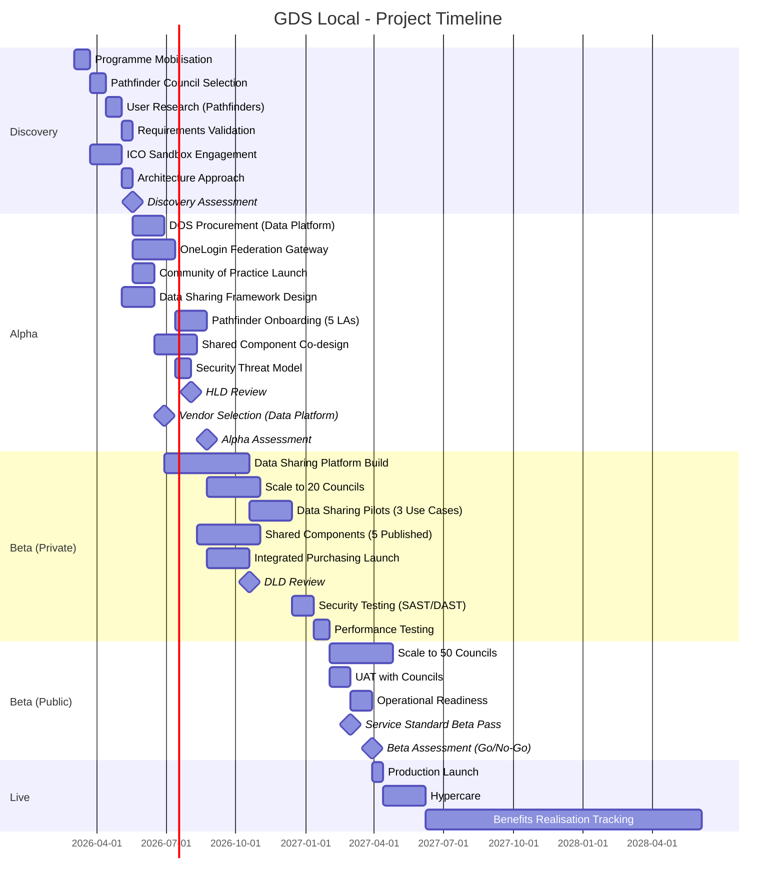
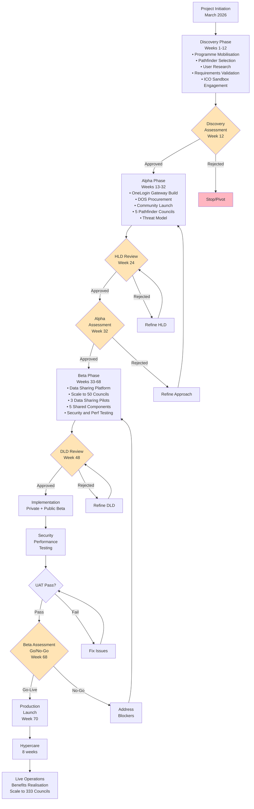

# Project Plan: GDS Local

> **Template Status**: Beta | **Version**: 2.5.0 | **Command**: `/arckit.plan`

## Document Control

| Field | Value |
|-------|-------|
| **Document ID** | ARC-001-PLAN-v1.0 |
| **Document Type** | Project Plan |
| **Project** | GDS Local (Project 001) |
| **Classification** | OFFICIAL |
| **Status** | DRAFT |
| **Version** | 1.0 |
| **Created Date** | 2026-02-17 |
| **Last Modified** | 2026-02-17 |
| **Review Cycle** | Monthly |
| **Next Review Date** | 2026-03-19 |
| **Owner** | [OWNER_NAME_AND_ROLE] |
| **Reviewed By** | PENDING |
| **Approved By** | PENDING |
| **Distribution** | GDS Local Programme Team, GDS Director General, DSIT Minister's Office, MHCLG Digital, LGA, DSIT Finance |

## Revision History

| Version | Date | Author | Changes | Approved By | Approval Date |
|---------|------|--------|---------|-------------|---------------|
| 1.0 | 2026-02-17 | ArcKit AI | Initial creation from `/arckit:plan` command | PENDING | PENDING |

---

## Executive Summary

**Project**: GDS Local
**Duration**: 20 months to Go-Live (68 weeks); 3-year programme to benefits realisation
**Budget**: £24M programme + £8.6M operational = £38.2M TCO (3-year, ROM ±30%)
**Team**: 35 FTE peak (Alpha/Beta), ramping from 15 FTE (Discovery) to 10 FTE (Live)
**Delivery Model**: GDS Agile Delivery (Discovery → Alpha → Beta → Live)

**Objective**: Bridge the digital divide between central and local government by extending GDS platforms (OneLogin, Notify, Pay) to 50 local authorities, enabling cross-service data sharing for vulnerable citizens, and delivering £50M in cumulative savings through shared technology and integrated purchasing.

**Success Criteria**:
- 50 local authorities live with at least one GDS Local platform by Q4 2027 (Goal G-1)
- 3 cross-service data sharing pilots operational with ICO endorsement by Q2 2027 (Goal G-2)
- 5 shared technology components published with 20+ council adopters by Q3 2027 (Goal G-3)
- £50M cumulative council savings through integrated purchasing over 3 years (Goal G-4)
- 100% GDS Service Standard pass rate at alpha and beta assessments (Goal G-5)
- Community of practice with 100+ active councils by Q4 2026 (Goal G-6)

**Key Milestones**:
- Discovery Complete: Week 12 (May 2026)
- Alpha Complete (HLD approved, pathfinders live): Week 32 (October 2026)
- Beta Complete (Go/No-Go): Week 68 (June 2027)
- Production Launch (50 councils): Q4 2027
- Benefits Realisation Review: Q4 2028

**Project Complexity**: Large (12-24 months) — 44+ requirements, 5+ integrations, custom data sharing platform build, multiple compliance regimes (UK GDPR, GDS Service Standard, NCSC, Accessibility Regulations)

---

## Timeline Overview (Gantt Chart)

---

## Workflow & Gates Diagram

---

## Discovery Phase (Weeks 1-12)

**Objective**: Validate problem, recruit pathfinder councils, establish governance, engage ICO

**Duration**: 12 weeks (March - May 2026)

### Activities & Timeline

| Week | Activity | ArcKit Command | Deliverable |
|------|----------|----------------|-------------|
| 1-3 | Programme mobilisation: establish Programme Board (GDS DG, MHCLG, LGA, DSIT Finance), recruit core team (15 FTE initial), set up programme governance | Manual | Programme Board ToR, initial team onboarded |
| 1-6 | ICO sandbox engagement: formal regulatory sandbox proposal for cross-service data sharing pilots | Manual | ICO sandbox agreement |
| 4-6 | Pathfinder council selection: LGA convenes willing councils, select 5 pathfinders across diverse types (metro, unitary, rural, district, county) | Manual | 5 confirmed pathfinder councils |
| 7-9 | User research with pathfinder councils: citizen interviews, council officer workshops, service mapping | Manual | User needs report, journey maps |
| 10-11 | Requirements validation: validate ARC-001-REQ-v1.0 with pathfinder council practitioners | `/arckit:requirements` (update) | Validated requirements document |
| 10-11 | Architecture approach: confirm technology stack, integration patterns, multi-tenancy design | `/arckit:diagram` | Architecture approach document |
| 12 | Discovery Assessment preparation | `/arckit:service-assessment` | Discovery assessment evidence pack |

### Gate: Discovery Assessment (Week 12)

**Approval Criteria**:
- [ ] Problem validated with 5 pathfinder councils and citizens
- [ ] User needs documented for citizens, council officers, and council IT teams
- [ ] Requirements validated and refined (ARC-001-REQ-v1.0 updated)
- [ ] Architecture principles confirmed (ARC-000-PRIN-v1.1)
- [ ] Business case approved (ARC-001-SOBC-v1.0 — BCR 2.8:1)
- [ ] Risk register reviewed and updated (ARC-001-RISK-v1.0 — 20 risks, 0 critical)
- [ ] 5 pathfinder councils confirmed and committed
- [ ] ICO sandbox engagement agreed
- [ ] Programme Board established with MHCLG and LGA representation
- [ ] Funding confirmed (minimum £24M over 3 years)

**Approvers**: GDS Director General (SRO), Programme Board

**Possible Outcomes**:
- **Go to Alpha** — Problem validated, pathfinders committed, funding confirmed
- **Pivot** — Adjust scope based on pathfinder feedback (e.g., reduce from 3 data sharing use cases to 2)
- **Stop** — Funding not approved, insufficient council interest, or ICO rejects sandbox

---

## Alpha Phase (Weeks 13-32)

**Objective**: Build OneLogin gateway, procure data sharing platform vendor, onboard 5 pathfinder councils, design HLD, pass alpha assessment

**Duration**: 20 weeks (June - October 2026)

### Activities & Timeline

| Week | Activity | ArcKit Command | Deliverable |
|------|----------|----------------|-------------|
| 13-18 | DOS procurement: competitive tender for data sharing platform build team via DOS 6 framework | `/arckit:sow` | SOW/RFP published, vendor shortlisted |
| 13-20 | OneLogin federation gateway build: OIDC federation gateway enabling council service provider registration and citizen authentication | `/arckit:diagram` | Working OneLogin federation gateway |
| 13-16 | Community of practice launch: Discourse platform, LGA convening first cohort, monthly meetups | Manual | Community platform live, 50+ council registrations |
| 13-18 | Data sharing governance framework: DPIA approach, DSA templates, lawful basis documentation (with ICO sandbox) | `/arckit:dpia` | Data sharing governance framework |
| 19-24 | Pathfinder council onboarding: integrate 5 councils with OneLogin via self-service portal | Manual | 5 councils live with OneLogin |
| 13-20 | Shared component co-design: workshops with council practitioners to define 5 priority components | Manual | Component prioritisation and specifications |
| 21-23 | Security threat model: STRIDE analysis for OneLogin federation, data sharing, and API gateway | `/arckit:secure` | Threat model report |
| 21-24 | HLD development: C4 architecture diagrams, integration patterns, security architecture | `/arckit:diagram` | High-Level Design document |
| 24 | HLD Review | `/arckit:hld-review` | HLD approved |
| 18 | Vendor selection: data sharing platform build vendor selected | `/arckit:evaluate` | Vendor evaluation matrix, contract signed |
| 25-28 | Data sharing framework pilot design: 3 use cases (housing-health, social care-benefits, planning-transport) detailed design | `/arckit:data-model` | Data sharing pilot designs |
| 29-30 | Updated business case: refine costs with pathfinder learning and vendor pricing | `/arckit:sobc` (update) | Updated SOBC / OBC draft |
| 30 | GDS Service Standard alpha assessment | `/arckit:service-assessment` | Alpha assessment pass |
| 32 | Alpha Assessment | Manual | Alpha assessment approval |

### Gate: HLD Review (Week 24)

**Approval Criteria**:
- [ ] All MUST requirements addressed in architecture design
- [ ] Architecture principles compliance demonstrated (25 principles)
- [ ] Security architecture defined with NCSC engagement
- [ ] Integration approach documented for OneLogin, council systems, data sharing
- [ ] Performance approach documented (99.9% availability, <500ms auth, <2s data sharing)
- [ ] Multi-tenancy design validated (333-council scaling path)
- [ ] No unmitigated high risks

**Approvers**: Architecture Board, Security Lead, NCSC representative

### Gate: Alpha Assessment (Week 32)

**Approval Criteria**:
- [ ] OneLogin federation gateway live with 5 pathfinder councils
- [ ] GDS Service Standard alpha assessment passed
- [ ] Data sharing platform vendor selected and contracted
- [ ] ICO sandbox engagement producing results
- [ ] Community of practice: 100+ council registrations
- [ ] Business case updated with pathfinder evidence
- [ ] Team and budget confirmed for Beta (35 FTE, £13M Year 2)
- [ ] Technical feasibility demonstrated through pathfinder integrations

**Approvers**: GDS Director General (SRO), Programme Board, DSIT Finance

**Possible Outcomes**:
- **Go to Beta** — Pathfinders successful, vendor contracted, design validated
- **Iterate** — Extend Alpha by 4 weeks to address specific concerns
- **Stop** — Pathfinder councils report poor experience, or funding not confirmed for Year 2

---

## Beta Phase (Weeks 33-68)

**Objective**: Build data sharing platform, scale to 50 councils, deliver 3 data sharing pilots, publish 5 shared components, pass beta assessment

**Duration**: 36 weeks (October 2026 - June 2027)

### Private Beta (Weeks 33-52)

| Week | Activity | ArcKit Command | Deliverable |
|------|----------|----------------|-------------|
| 33-48 | Data sharing platform build: custom platform with governance dashboard, audit trails, purpose limitation enforcement | Manual (vendor delivery) | Data sharing platform v1.0 |
| 33-42 | Scale to 20 councils: extend OneLogin onboarding from 5 pathfinders to 20 councils, with self-service portal | Manual | 20 councils live with OneLogin |
| 33-40 | Integrated purchasing framework launch: LGA-led collective procurement for common council technology | Manual | Purchasing framework operational |
| 33-44 | Shared component development: 5 co-designed components built and published to catalogue | Manual | 5 shared components in catalogue |
| 48 | DLD Review: data sharing platform detailed design reviewed | `/arckit:dld-review` | DLD approved |
| 49-56 | Data sharing pilots: 3 use cases (housing-health, social care-benefits, planning-transport) across 10 councils | Manual | 3 data sharing pilots operational |
| 49-52 | Security testing: SAST/DAST, penetration testing by CHECK-certified provider | Manual | Security test results (zero critical/high) |
| 52 | ICO data sharing framework endorsement | Manual | Formal ICO endorsement |

### Public Beta (Weeks 53-68)

| Week | Activity | ArcKit Command | Deliverable |
|------|----------|----------------|-------------|
| 53-64 | Scale to 50+ councils: extend onboarding, peer advocacy, LGA convening | Manual | 50+ councils live |
| 53-56 | Performance testing: load testing at 50-council scale (50K auth/day, 5K data sharing queries/day) | Manual | Performance test results (all targets met) |
| 57-60 | UAT with councils: council IT teams and service managers validate end-to-end flows | Manual | UAT sign-off from participating councils |
| 61-64 | Operational readiness: runbooks, DR/BCP testing, support model, on-call | `/arckit:operationalize` | Operational readiness pack |
| 61-64 | Quality analysis and traceability | `/arckit:analyze`, `/arckit:traceability` | Quality report, traceability matrix |
| 60 | GDS Service Standard beta assessment | `/arckit:service-assessment` | Beta assessment pass |
| 65-68 | Final hardening and go-live preparation | Manual | Go-live checklist complete |
| 68 | Beta Assessment (Go/No-Go) | Manual | Go-live approved |

### Gate: DLD Review (Week 48)

**Approval Criteria**:
- [ ] Data sharing platform DLD aligns with approved HLD
- [ ] All implementation details documented (APIs, data flows, security controls)
- [ ] Test strategy defined (functional, security, performance, accessibility, multi-tenancy)
- [ ] Deployment approach documented (blue-green, canary)
- [ ] Rollback strategy tested

**Approvers**: Technical Lead, Architecture Board

### Gate: Beta Assessment / Go-Live (Week 68)

**Approval Criteria**:
- [ ] 50+ councils live with at least one GDS Local platform
- [ ] 3 data sharing pilots operational with ICO endorsement
- [ ] 5 shared components published with 20+ council adopters
- [ ] GDS Service Standard beta assessment passed (100% pass rate)
- [ ] Security testing passed: zero critical/high vulnerabilities
- [ ] Performance testing passed: 99.9% availability, <500ms auth, <2s data sharing
- [ ] UAT signed off by participating councils
- [ ] Operational readiness confirmed: runbooks, DR/BCP tested, support team trained
- [ ] All MUST requirements implemented and tested (ARC-001-REQ-v1.0)
- [ ] Benefits tracking active: procurement savings, adoption metrics, citizen outcomes

**Approvers**: GDS Director General (SRO), Programme Board, Security Lead, Operations Lead, NCSC

**Possible Outcomes**:
- **Go-Live** — All criteria met, ready for production operation and continued scaling
- **Fix Issues** — Address specific blockers (2-4 week remediation window)
- **No-Go** — Major issues requiring significant rework (return to Beta)

---

## Live Phase (Week 69+)

**Objective**: Operate at scale, realise benefits, continue scaling toward 333 councils

**Duration**: Ongoing from July 2027

### Activities & Timeline

| Week | Activity | ArcKit Command | Deliverable |
|------|----------|----------------|-------------|
| 69-70 | Production launch: formal go-live, communications to all councils | Manual | Live service |
| 71-78 | Hypercare: dedicated support team, daily incident review, rapid bug fixes | Manual | Stable production operation |
| 79+ | Continued council onboarding: scale from 50 toward 150 councils (Q4 2028 target) | Manual | Adoption growth |
| 79+ | Benefits realisation tracking: procurement savings, technology cost avoidance, citizen outcomes | Manual | Quarterly benefits reports |
| Quarterly | Quality reviews | `/arckit:analyze` | Quality analysis reports |
| Quarterly | Risk register updates | `/arckit:risk` (update) | Updated risk register |
| Quarterly | Principles compliance check | `/arckit:principles-compliance` | Compliance scorecard |
| Annually | Business case update: benefits realisation audit (NAO-ready) | `/arckit:sobc` (update) | Annual benefits report |
| Q4 2028 | Benefits realisation review: 12-month post-scale assessment | Manual | Independent benefits audit |

---

## ArcKit Commands Integration

### Discovery Phase (Weeks 1-12)
| Week | Command | Purpose |
|------|---------|---------|
| 10-11 | `/arckit:requirements` | Validate requirements with pathfinder councils |
| 10-11 | `/arckit:diagram` | Architecture approach diagrams |
| 12 | `/arckit:service-assessment` | Prepare Discovery assessment evidence |

### Alpha Phase (Weeks 13-32)
| Week | Command | Purpose |
|------|---------|---------|
| 13-18 | `/arckit:sow` | Generate SOW/RFP for data sharing platform vendor |
| 13-18 | `/arckit:dpia` | Data Protection Impact Assessment for data sharing |
| 18 | `/arckit:evaluate` | Vendor evaluation scoring matrix |
| 13-24 | `/arckit:diagram` | C4 architecture diagrams (context, container, component) |
| 21-23 | `/arckit:secure` | Secure by Design assessment |
| 24 | `/arckit:hld-review` | HLD approval gate |
| 25-28 | `/arckit:data-model` | Data model for cross-service data sharing |
| 29-30 | `/arckit:sobc` | Updated business case with pathfinder evidence |
| 30 | `/arckit:service-assessment` | Alpha assessment preparation |

### Beta Phase (Weeks 33-68)
| Week | Command | Purpose |
|------|---------|---------|
| 48 | `/arckit:dld-review` | DLD approval gate |
| 53-56 | `/arckit:devops` | DevOps strategy and CI/CD pipeline design |
| 61-64 | `/arckit:operationalize` | Operational readiness pack (runbooks, DR, BCP) |
| 61-64 | `/arckit:servicenow` | ServiceNow design (CMDB, SLAs, incident management) |
| 61-64 | `/arckit:analyze` | Quality analysis across all artifacts |
| 61-64 | `/arckit:traceability` | Requirements traceability matrix |
| 60 | `/arckit:service-assessment` | Beta assessment preparation |
| 65 | `/arckit:tcop` | Technology Code of Practice review |
| 65 | `/arckit:secure` | Updated Secure by Design assessment |
| 65 | `/arckit:principles-compliance` | Principles compliance scorecard |

### Live Phase (Week 69+)
| Frequency | Command | Purpose |
|-----------|---------|---------|
| Quarterly | `/arckit:analyze` | Periodic quality reviews |
| Quarterly | `/arckit:risk` | Update operational risks |
| Quarterly | `/arckit:principles-compliance` | Ongoing compliance monitoring |
| Annually | `/arckit:sobc` | Benefits realisation tracking |
| As needed | `/arckit:adr` | Document new architecture decisions |

---

## Resource Plan

### Team Sizing by Phase

| Phase | Duration | Team Size | Key Roles |
|-------|----------|-----------|-----------|
| Discovery | 12 weeks | 15 FTE | Programme Director, Product Managers (2), Technical Architect, User Researchers (2), Delivery Manager, BA, Security Architect, Community Manager, Council Onboarding Lead, PMO |
| Alpha | 20 weeks | 30 FTE | + Software Engineers (6), Content Designers (2), Data Sharing Policy Lead, Performance Analyst, Commercial Lead, Comms Lead, additional Council Onboarding (3) |
| Beta | 36 weeks | 35 FTE | Full team + vendor delivery team (6-8 via DOS) |
| Live | Ongoing | 10 FTE | Operations team, Community Manager, Support (3), Performance Analyst, Programme PMO |

### Budget Summary

| Phase | Duration | Team Cost | Infrastructure | Vendor/Licence | Total |
|-------|----------|-----------|----------------|----------------|-------|
| Discovery | 12 weeks | £2.5M | £0.2M | £0 | £2.7M |
| Alpha | 20 weeks | £5.0M | £0.5M | £1.5M (DOS) | £7.0M |
| Beta | 36 weeks | £7.5M | £2.0M | £3.0M (DOS + hosting) | £12.5M |
| Live (Year 1 post-launch) | 12 months | £2.5M | £2.5M | £0.5M | £5.5M |
| Contingency (15%) | | | | | £3.9M |
| **Total (3-Year Programme)** | | | | | **£31.6M** |

*Note: Budget aligned with SOBC Option 2 (£29.6M programme + operational). Civil servant costs at average £80K total cost of employment. Contractor rates at DOS framework rates. Cloud infrastructure (AWS UK) consumption-based.*

---

## Risks & Assumptions

### Key Risks (from ARC-001-RISK-v1.0)

| Risk ID | Risk | Impact | Likelihood | Residual Score | Mitigation |
|---------|------|--------|------------|----------------|------------|
| R-001 | Insufficient local authority adoption | HIGH | MEDIUM | 12 | Pathfinder approach, free platforms, LGA co-leadership, funded onboarding |
| R-002 | Ministerial direction or MoG change | HIGH | MEDIUM | 10 | Cross-party support, resilient architecture, scope flexibility |
| R-008 | Programme funding not sustained beyond Year 1 | HIGH | MEDIUM | 10 | Multi-year spending review bid, early benefits evidence, phased delivery |
| R-011 | Data sharing privacy breach triggers ICO enforcement | CRITICAL | LOW | 10 | Governance-first approach, ICO sandbox, DPIAs, purpose limitation, audit trails |
| R-018 | Custom data sharing platform development delays | MEDIUM | MEDIUM | 9 | Agile delivery with sprint gates, experienced vendor via DOS, MVP approach |
| R-004 | GDS platform team capacity constraints | MEDIUM | HIGH | 9 | Dedicated local gov capacity within platform teams, prioritise OneLogin |
| R-003 | "Whitehall imposing on councils" perception | HIGH | MEDIUM | 9 | LGA co-lead, council co-design, voluntary model, joint communications |

### Key Assumptions

| ID | Assumption | Risk if Wrong | Validation |
|----|-----------|---------------|------------|
| A-1 | GOV.UK OneLogin ready for LA federation by Q3 2026 | G-1 delayed 6-12 months | OneLogin team engagement Q1 2026 |
| A-2 | 5+ pathfinder councils volunteer | Cannot demonstrate value early | LGA recruitment Q1-Q2 2026 |
| A-3 | ICO engages constructively with sandbox | G-2 blocked | ICO pre-engagement Q1 2026 |
| A-4 | GDS platforms need minimal modification for LA use | Additional £2-5M cost | GDS platform review Q1 2026 |
| A-5 | 3-year DSIT funding sustained | Programme cancelled | Spending review Q1 2026 |
| A-6 | Councils achieve 20% savings through collective procurement | £50M target not met | Pilot procurement Q3 2026 |

### Dependencies

| Dependency | Owner | Target Date | Impact if Delayed |
|------------|-------|-------------|-------------------|
| GOV.UK OneLogin platform readiness | GDS OneLogin Team | Q3 2026 | HIGH — blocks G-1, entire Alpha phase |
| ICO regulatory sandbox engagement | GDS Local + ICO | Q2 2026 | HIGH — blocks G-2 data sharing pilots |
| 5 pathfinder councils recruited | LGA + GDS Local | Q2 2026 | HIGH — blocks all goals |
| DSIT programme funding confirmed | DSIT Finance | Q1 2026 | CRITICAL — blocks programme |
| Crown Commercial Service alignment | LGA + CCS | Q3 2026 | MEDIUM — blocks G-4 purchasing framework |
| DOS procurement for data sharing vendor | GDS Local Commercial | Q3 2026 | HIGH — blocks data sharing platform build |

---

## Timeline Estimates

### Phase Duration Summary

| Phase | Start | End | Duration | Councils Live |
|-------|-------|-----|----------|---------------|
| Discovery | March 2026 | May 2026 | 12 weeks | 0 |
| Alpha | June 2026 | October 2026 | 20 weeks | 5 (pathfinders) |
| Beta (Private) | October 2026 | March 2027 | 20 weeks | 20 |
| Beta (Public) | March 2027 | June 2027 | 16 weeks | 50 |
| Live | July 2027 | Ongoing | Ongoing | 50 → 150 → 333 |

### Scaling Trajectory

| Milestone | Date | Councils | Citizens Served |
|-----------|------|----------|-----------------|
| Pathfinder go-live | Q3 2026 | 5 | ~2M |
| Private beta scale | Q4 2026 | 20 | ~8M |
| Public beta scale | Q2 2027 | 50 | ~15M |
| Year 2 target | Q4 2028 | 150 | ~30M |
| Full adoption (aspirational) | 2029+ | 333 | ~56M |

### Timeline Adjustments Applied

| Factor | Adjustment | Rationale |
|--------|------------|-----------|
| Vendor procurement (DOS) | +6 weeks to Alpha | DOS competitive procurement for data sharing platform build |
| ICO regulatory engagement | +4 weeks to Discovery | ICO sandbox engagement requires formal proposal and agreement |
| Data sharing compliance | +8 weeks to Beta | DPIAs, DSAs, ICO endorsement for 3 pilot use cases |
| NCSC security review | +3 weeks to Alpha | NCSC engagement for security architecture review at HLD gate |
| Multi-authority scaling | +12 weeks to Beta | Onboarding 50 councils with diverse technical estates |

---

## Appendix A: Glossary

| Term | Definition |
|------|------------|
| GDS | Government Digital Service |
| DSIT | Department for Science, Innovation and Technology |
| MHCLG | Ministry of Housing, Communities and Local Government |
| LGA | Local Government Association |
| HLD | High-Level Design |
| DLD | Detailed-Level Design |
| UAT | User Acceptance Testing |
| SRO | Senior Responsible Owner |
| BA | Business Analyst |
| NFR | Non-Functional Requirement |
| DOS | Digital Outcomes and Specialists (Digital Marketplace framework) |
| OIDC | OpenID Connect (identity federation standard) |
| DSA | Data Sharing Agreement |
| DPIA | Data Protection Impact Assessment |
| ICO | Information Commissioner's Office |
| NCSC | National Cyber Security Centre |
| NAO | National Audit Office |
| TCoP | Technology Code of Practice |
| BCR | Benefit-Cost Ratio |
| FTE | Full-Time Equivalent |

## External References

| Document | Type | Source | Key Extractions | Path |
|----------|------|--------|-----------------|------|
| ARC-001-STKE-v1.0 | Stakeholder Analysis | ArcKit | 11 drivers, 6 goals, 4 outcomes, RACI matrix | projects/001-gds-local/ARC-001-STKE-v1.0.md |
| ARC-000-PRIN-v1.1 | Architecture Principles | ArcKit | 25 principles including GDS Local collaboration, data sharing, federated identity | projects/000-global/ARC-000-PRIN-v1.1.md |
| ARC-001-REQ-v1.0 | Requirements | ArcKit | 6 BRs, 10 FRs, 18 NFRs, 5 INTs, 5 DRs | projects/001-gds-local/ARC-001-REQ-v1.0.md |
| ARC-001-SOBC-v1.0 | Strategic Outline Business Case | ArcKit | £24M investment, BCR 2.8:1, Option 2 recommended | projects/001-gds-local/ARC-001-SOBC-v1.0.md |
| ARC-001-RISK-v1.0 | Risk Register | ArcKit | 20 risks, 7 exceeding appetite, 35% control effectiveness | projects/001-gds-local/ARC-001-RISK-v1.0.md |
| ARC-001-RSCH-v1.0 | Technology Research | ArcKit | Build vs buy analysis, vendor recommendations | projects/001-gds-local/ARC-001-RSCH-v1.0.md |

---

**Generated by**: ArcKit `/arckit:plan` command
**Generated on**: 2026-02-17 14:30 GMT
**ArcKit Version**: 2.5.0
**Project**: GDS Local (Project 001)
**AI Model**: Claude Opus 4.6
**Generation Context**: Plan derived from ARC-001-STKE-v1.0 (stakeholders), ARC-001-REQ-v1.0 (requirements), ARC-000-PRIN-v1.1 (principles), ARC-001-SOBC-v1.0 (business case), and ARC-001-RISK-v1.0 (risk register). Large complexity (12-24 months), Agile GDS delivery approach.
