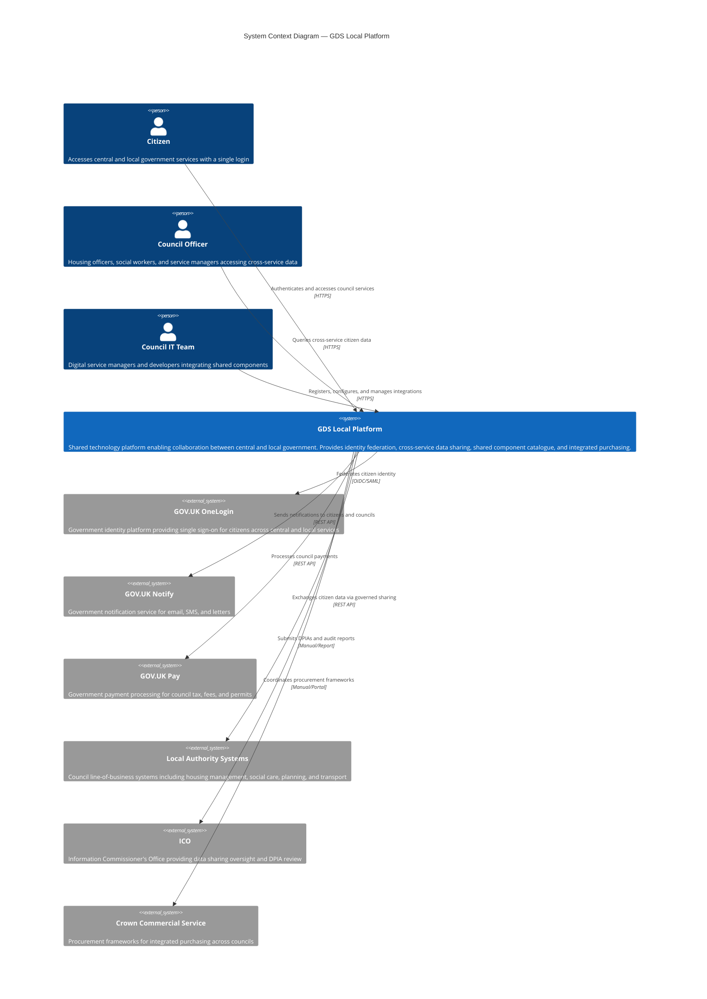

# Architecture Diagram: GDS Local Platform — System Context

> **Template Status**: Live | **Version**: 2.11.0 | **Command**: `/arckit.diagram`

## Document Control

| Field | Value |
|-------|-------|
| **Document ID** | ARC-001-DIAG-001-v1.0 |
| **Document Type** | Architecture Diagram |
| **Project** | GDS Local (Project 001) |
| **Classification** | OFFICIAL |
| **Status** | DRAFT |
| **Version** | 1.0 |
| **Created Date** | 2026-02-26 |
| **Last Modified** | 2026-02-26 |
| **Review Cycle** | Monthly |
| **Next Review Date** | 2026-03-28 |
| **Owner** | [OWNER_NAME_AND_ROLE] |
| **Reviewed By** | [PENDING] |
| **Approved By** | [PENDING] |
| **Distribution** | GDS Local Programme Team, Architecture Team, MHCLG Digital, LGA, Pilot Council Representatives |

## Revision History

| Version | Date | Author | Changes | Approved By | Approval Date |
|---------|------|--------|---------|-------------|---------------|
| 1.0 | 2026-02-26 | ArcKit AI | Initial creation from `/arckit:diagram` command | [PENDING] | [PENDING] |

---

## Diagram

### Mermaid Format

**View this diagram**:
- **GitHub**: Renders automatically in markdown preview
- **VS Code**: Install Mermaid Preview extension
- **Online**: https://mermaid.live (paste code above)
- **Export**: Use mermaid.live to export as PNG/SVG/PDF

---

## Component Inventory

| Component | Type | Technology | Responsibility | Evolution Stage | Build/Buy |
|-----------|------|------------|----------------|-----------------|-----------|
| GDS Local Platform | Software System | Cloud-hosted (TBC) | Shared platform for identity federation, data sharing, component catalogue, purchasing, and community of practice | Custom (0.35) | BUILD |
| GOV.UK OneLogin | External System | OIDC/SAML 2.0 | Citizen identity and authentication across central and local government | Product (0.65) | REUSE |
| GOV.UK Notify | External System | REST API | Email, SMS, and letter notifications for citizens and councils | Commodity (0.85) | REUSE |
| GOV.UK Pay | External System | REST API + redirect flow | Payment processing for council tax, planning fees, parking permits | Commodity (0.85) | REUSE |
| Local Authority Systems | External Systems | Various (diverse technology stacks across 333 councils) | Housing management, social care, planning, transport — council line-of-business applications | Product (0.60) | N/A (external) |
| ICO | External Organisation | Manual/Report | Data sharing oversight, DPIA review, regulatory sandbox | N/A | N/A (regulator) |
| Crown Commercial Service | External Organisation | Portal/Manual | Procurement frameworks for integrated purchasing | N/A | N/A (government body) |

**Evolution Stage Legend**:
- **Genesis (0.0-0.25)**: Novel, unproven, rapidly changing
- **Custom (0.25-0.50)**: Bespoke, emerging practices
- **Product (0.50-0.75)**: Commercial products with feature differentiation
- **Commodity (0.75-1.0)**: Utility services, standardised

**Build/Buy Decision**:
- **BUILD**: Genesis/Custom components with competitive advantage
- **BUY**: Product components with mature market
- **USE**: Commodity cloud/utility services
- **REUSE**: GOV.UK services (UK Government platform reuse)

---

## Architecture Decisions

### Key Design Decisions

**Decision 1**: Extend existing GOV.UK platforms rather than building new equivalents
- **Context**: Citizens need single sign-on and notifications across central and local government. Councils currently maintain bespoke equivalents of GOV.UK OneLogin, Notify, and Pay.
- **Decision**: Extend GOV.UK OneLogin, Notify, and Pay to local authorities via open standards (OIDC, REST APIs) rather than building new platforms.
- **Rationale**: GDS platforms are proven, assured, and free at point of use. Extending them avoids duplicated spend and aligns with TCoP Point 8 (Share and Reuse). Addresses BR-001, principles P4, P13, P16.
- **Consequences**: Dependency on GDS platform teams' capacity and roadmaps. Local authority extensions must be additive only (TC-1). Requires fallback authentication when OneLogin is unavailable.

**Decision 2**: Governed data sharing via purpose-limited API queries, not bulk data transfer
- **Context**: Cross-service data sharing (housing-health, social care-benefits) is needed to support vulnerable citizens, but privacy risks are significant.
- **Decision**: Data sharing via purpose-limited API queries with full audit trail, governed by Data Sharing Agreements and approved DPIAs. No bulk data transfers.
- **Rationale**: Purpose limitation and minimisation are UK GDPR requirements. ICO engagement via regulatory sandbox builds trust. Addresses BR-002, NFR-C-001, principle P9.
- **Consequences**: Data sharing platform must enforce DSA validity, purpose codes, and audit logging on every query. Requires ICO endorsement before scaling. Performance target of < 2 seconds per query.

**Decision 3**: Voluntary adoption model with pathfinder approach
- **Context**: 50 councils targeted by Q4 2027, but local authorities are independent democratic bodies and cannot be mandated.
- **Decision**: Pathfinder approach — 5 enthusiastic councils in Phase 1, scaling to 20, then 50 via peer advocacy and demonstrated savings.
- **Rationale**: Voluntary adoption maintains the partnership model essential for LGA engagement. Pathfinders provide early evidence of value. Addresses BR-006 and Conflict C-1 resolution.
- **Consequences**: Self-service onboarding portal (FR-002) is critical. Must demonstrate compelling value quickly. Phased scaling means infrastructure must handle 5-333 councils without architectural changes.

**Decision 4**: Open standards integration for council diversity
- **Context**: 333 councils have diverse technology stacks — no assumptions can be made about council technology.
- **Decision**: All integrations use open standards only (REST, OIDC, SAML, OAuth 2.0). Batch/file-based fallback for councils with limited API capability.
- **Rationale**: TC-2 mandates open standards. Diverse council estates make proprietary integration infeasible. Aligns with TCoP Point 3 (Open Source/Standards), principle P4.
- **Consequences**: API gateway (FR-009) must support multiple authentication patterns. Developer portal and documentation are essential for self-service. 6-month deprecation period for breaking API changes.

### Technology Choices

| Technology | Purpose | Rationale | Evolution Stage |
|------------|---------|-----------|-----------------|
| OIDC / SAML 2.0 | Identity federation | Open standards for GOV.UK OneLogin integration; supported by all major identity providers | Commodity (0.90) |
| REST APIs (OpenAPI) | System integration | Universal, well-understood, tooling-rich; supports diverse council technology stacks | Commodity (0.95) |
| OAuth 2.0 | API authentication | Industry standard for API security; council-scoped client credentials | Commodity (0.90) |
| TLS 1.3 | Transport security | NCSC recommended; mandatory for all communications (NFR-SEC-003) | Commodity (0.95) |
| AES-256 | Data at rest encryption | NCSC recommended; mandatory for all data stores (NFR-SEC-003) | Commodity (0.95) |
| GOV.UK Design System | Citizen-facing UI | GDS Service Standard mandates its use; ensures accessibility (WCAG 2.2 AA) | Commodity (0.85) |

---

## Requirements Traceability

**Requirements Coverage**:

| Requirement ID | Description | Component(s) | Coverage Status |
|----------------|-------------|--------------|-----------------|
| BR-001 | Extend GDS platforms to local authorities | GDS Local Platform, GOV.UK OneLogin, GOV.UK Notify, GOV.UK Pay | ✅ Covered |
| BR-002 | Enable cross-service data sharing with privacy | GDS Local Platform, Local Authority Systems, ICO | ✅ Covered |
| BR-003 | Deliver measurable cost savings | GDS Local Platform, Crown Commercial Service | ✅ Covered |
| BR-004 | Co-design with local government practitioners | GDS Local Platform (community of practice) | ✅ Covered |
| BR-005 | Meet GDS Service Standard | GDS Local Platform (all public-facing components) | ✅ Covered |
| BR-006 | Voluntary adoption model | GDS Local Platform (self-service onboarding) | ✅ Covered |
| FR-001 | OneLogin federation gateway | GDS Local Platform, GOV.UK OneLogin | ✅ Covered |
| FR-002 | Self-service onboarding portal | GDS Local Platform | ✅ Covered |
| FR-003 | Shared component catalogue | GDS Local Platform | ✅ Covered |
| FR-004 | Cross-service data sharing platform | GDS Local Platform, Local Authority Systems | ✅ Covered |
| FR-005 | Data sharing governance dashboard | GDS Local Platform | ✅ Covered |
| FR-006 | Community of practice platform | GDS Local Platform | ✅ Covered |
| FR-007 | Integrated purchasing portal | GDS Local Platform, Crown Commercial Service | ✅ Covered |
| FR-008 | Platform health and status dashboard | GDS Local Platform | ✅ Covered |
| FR-009 | API gateway with rate limiting | GDS Local Platform | ✅ Covered |
| FR-010 | Citizen consent management | GDS Local Platform | ✅ Covered |
| INT-001 | GOV.UK OneLogin integration | GDS Local Platform, GOV.UK OneLogin | ✅ Covered |
| INT-002 | Local authority LoB system integration | GDS Local Platform, Local Authority Systems | ✅ Covered |
| INT-003 | GOV.UK Notify extension | GDS Local Platform, GOV.UK Notify | ✅ Covered |
| INT-004 | GOV.UK Pay extension | GDS Local Platform, GOV.UK Pay | ✅ Covered |
| INT-005 | ICO regulatory interface | GDS Local Platform, ICO | ✅ Covered |

**Coverage Summary**:
- Total Requirements: 21 (6 BR + 10 FR + 5 INT)
- Covered: 21 (100%)
- Partially Covered: 0
- Not Covered: 0

> **Note**: NFR and DR requirements are captured at the system level in this context diagram. Detailed NFR coverage (performance targets, security controls, availability) will be validated in the C4 Container diagram (Level 2) when containers and technology choices are specified.

---

## Integration Points

### External Systems

| External System | Interface | Protocol | Responsibility | SLA |
|----------------|-----------|----------|----------------|-----|
| GOV.UK OneLogin | Identity federation | OIDC/SAML 2.0 | Citizen authentication across council services; identity assertion (name, email, verified address) | 99.9% availability; < 500ms auth flow |
| GOV.UK Notify | Notification API | REST API (HTTPS) | Email, SMS, and letter notifications to citizens and councils with council-branded templates | 99.95% availability |
| GOV.UK Pay | Payment API + redirect | REST API (HTTPS) | Payment processing for council tax, planning fees, parking permits; PCI-DSS maintained by Pay | 99.9% availability |
| Local Authority Systems | Data sharing and component consumption | REST API via API gateway; event-driven notifications | Citizen data responses to authorised queries; consuming shared components | Best-effort (council-dependent); platform adds < 100ms latency |
| ICO | Regulatory reporting | Manual/Report | DPIA submission, audit reports, breach notification, regulatory sandbox engagement | N/A (manual) |
| Crown Commercial Service | Procurement coordination | Manual/Portal | Integrated purchasing frameworks for common technology needs | N/A (manual) |

### APIs and Endpoints

| API | Endpoint | Method | Purpose | Authentication |
|-----|----------|--------|---------|----------------|
| OneLogin Federation | `/auth/authorize` | GET/POST | Citizen authentication via OIDC | Mutual TLS (service provider registration) |
| Data Sharing | `/api/v1/data-sharing/query` | POST | Cross-service citizen data queries with purpose codes | OAuth 2.0 client credentials (council-scoped) |
| Component Catalogue | `/api/v1/catalogue` | GET | Browse shared components and documentation | API key (council-scoped) |
| Onboarding | `/api/v1/onboarding` | POST | Council self-service registration and configuration | API key + MFA |
| Notify Extension | `/api/v1/notifications` | POST | Send notifications via GOV.UK Notify | API key (council-scoped) |
| Pay Extension | `/api/v1/payments` | POST | Process payments via GOV.UK Pay | API key (council-scoped) |
| Health Status | `/status` | GET | Platform health check (public) | None (public) |

---

## Data Flow

### Data Sources

| Data Source | Type | Data Format | Update Frequency | Owner |
|-------------|------|-------------|------------------|-------|
| Citizen (via OneLogin) | Identity assertion | OIDC JWT / SAML assertion | Per authentication event | GDS OneLogin Team |
| Council systems (housing, social care) | Citizen service data | JSON via REST API | Real-time per query | Individual councils |
| Council IT teams | Registration and configuration | JSON via portal | On onboarding/change | Individual councils |
| ICO | Regulatory guidance | Documents/correspondence | Ad hoc | ICO |

### Data Sinks

| Data Sink | Type | Data Format | Retention | Backup |
|-----------|------|-------------|-----------|--------|
| Authentication event logs | Audit log | Structured JSON | 7 years | Continuous replication + daily backup |
| Data sharing audit logs | Audit log | Structured JSON | 7 years (tamper-evident) | Continuous replication + daily backup |
| Council registration data | Operational data | Relational | Active + 2 years after departure | Daily backup |
| DSA records | Governance data | Relational/Document | Active + 7 years after expiry | Daily backup |
| Community engagement data | Operational data | Relational | Active; anonymised after departure | Daily backup |

### PII Handling (UK GDPR Compliance)

| Component | PII Type | Processing | Legal Basis | Retention | Deletion |
|-----------|----------|------------|-------------|-----------|----------|
| GDS Local Platform (OneLogin federation) | Name, email, verified address | Pass-through from OneLogin to council service; no bulk storage | Public task (council service delivery) | Session data: 90 days; auth logs: 7 years | Automated purge at retention expiry |
| GDS Local Platform (data sharing) | Citizen service records (housing, health flags, social care status) | Purpose-limited query with summary response; no bulk transfer | Public task / consent (varies by use case, per DPIA) | Query results: transient; audit logs: 7 years | Query results not persisted; audit logs immutable |
| GDS Local Platform (onboarding) | Council staff names, roles, contact details | Registration and access management | Legitimate interest (platform administration) | Active + 2 years | Deletion on request or departure |

**DPIA Required**: Yes — required for all cross-service data sharing use cases (FR-004)
**DPO Consulted**: [PENDING] — ICO regulatory sandbox engagement in progress

---

## Security Architecture

### Security Zones

| Zone | Components | Security Level | Controls |
|------|------------|----------------|----------|
| Public Internet | Citizens accessing council services | Low trust | TLS 1.3, WAF, DDoS protection, rate limiting |
| Council Network | Council systems connecting via API gateway | Medium trust | OAuth 2.0, mutual TLS, IP allowlisting optional |
| Platform Core | GDS Local Platform internal services | High trust | Zero-trust (NFR-SEC-001), MFA for all admin access, tenant isolation |
| Data Sharing Zone | Cross-service data queries | Highest trust | Purpose-limited queries, DSA enforcement, full audit trail, end-to-end encryption |
| Regulatory | ICO reporting interface | Controlled | Audit report generation, breach notification within 72 hours |

### Security Controls

| Control | Type | Component(s) | Implementation |
|---------|------|--------------|----------------|
| Zero-trust authentication | Preventive | All components | No implicit trust based on network location (NFR-SEC-001) |
| Tenant isolation | Preventive | GDS Local Platform | Council A cannot access Council B's data/config (NFR-SEC-002) |
| Encryption in transit | Preventive | All communications | TLS 1.2+ (TLS 1.3 preferred) with strong cipher suites (NFR-SEC-003) |
| Encryption at rest | Preventive | All data stores | AES-256 with managed key rotation (NFR-SEC-003) |
| Tamper-evident audit logging | Detective | Data sharing, authentication | Cryptographic chaining; 7-year retention (NFR-SEC-004) |
| Vulnerability management | Preventive | All components | SAST/DAST in CI/CD; CHECK-certified annual pentest (NFR-SEC-005) |
| Circuit breaker | Resilience | Council system integrations | Per-council isolation; prevents cascading failures (NFR-A-003) |

### Authentication & Authorisation

| Component | Authentication | Authorisation | Session Management |
|-----------|----------------|---------------|-------------------|
| Citizen-facing services | GOV.UK OneLogin (OIDC/SAML + MFA) | Council service determines access | 30 min inactivity; 12 hr absolute |
| Council officer data sharing | Council IdP or GOV.UK OneLogin + MFA | Role-based + purpose code + DSA validation | 30 min inactivity; re-auth for queries |
| Council IT admin portal | OAuth 2.0 + MFA | Council-scoped admin roles | 30 min inactivity; re-auth for credential rotation |
| API integrations | OAuth 2.0 client credentials | Council-scoped API keys with rate limiting | Token-based; auto-rotation |

---

## Deployment Architecture

### Cloud Provider

**Provider**: TBC — Cloud First (TCoP Point 5) mandated; specific provider to be determined during research/Wardley Map phases
**Region**: UK sovereign data centres only (TC-4, NFR-C-001 data residency requirement)
**Availability Zones**: Minimum 2 AZs for critical systems (NFR-A-002: < 5 min failover)

### Infrastructure Components

| Component | Type | Spec | HA | Backup |
|-----------|------|------|-----|--------|
| API Gateway | Managed service | 10K+ concurrent sessions | Multi-AZ; 99.95% target | N/A (stateless) |
| Compute | Container/serverless | Auto-scaling 5-333 councils | Multi-AZ; min 2 instances | N/A (stateless) |
| Database (transactional) | Managed relational | Scale to 500K auth/day + 50K queries/day | Multi-AZ with sync replication | Continuous + daily; 90 days operational, 7 years compliance |
| Database (audit) | Append-only / immutable | 18M audit records/year | Multi-AZ | 7-year immutable retention |
| Cache | Managed cache | Session + response caching | Multi-AZ | N/A (ephemeral) |
| Message queue | Managed queue | Async event processing | Multi-AZ | N/A (transient) |

### Network Architecture

| Network Component | CIDR | Purpose | Security Group |
|------------------|------|---------|----------------|
| VPC | TBC | Platform boundary | Default deny; explicit allow |
| Public Subnet | TBC | Load balancer, WAF | HTTPS only (443) |
| Private Subnet (App) | TBC | Application tier | Internal only; no direct internet |
| Private Subnet (Data) | TBC | Databases, audit stores | App tier only; no external access |

---

## Non-Functional Requirements

### Performance

| Requirement | Target | Component(s) | How Achieved |
|-------------|--------|--------------|--------------|
| API response time (identity federation) | < 500ms (p95) | OneLogin integration, API Gateway | Low-latency federation; cached service provider metadata |
| API response time (data sharing) | < 2 seconds (p95) | Data Sharing Platform, API Gateway | Purpose-limited queries; indexed lookups; circuit breakers |
| API gateway added latency | < 50ms (p99) | API Gateway | Managed gateway service; edge caching |
| Portal page load | < 1 second (p95) | Onboarding Portal, Catalogue | CDN; GOV.UK Design System; progressive enhancement |

### Scalability

| Scalability Type | Approach | Component(s) | Max Scale |
|-----------------|----------|--------------|-----------|
| Horizontal | Auto-scaling compute; stateless services; multi-tenant architecture | All platform services | 333 councils; 500K auth/day; 50K data sharing queries/day |
| Data | Partitioned storage; council-scoped data isolation | Databases, audit stores | 56M citizens; 18M audit records/year |

### Availability & Resilience

| Requirement | Target | Component(s) | How Achieved |
|-------------|--------|--------------|--------------|
| Platform availability | 99.9% (43.8 min/month max unplanned downtime) | OneLogin gateway, data sharing, API gateway | Multi-AZ deployment; automated failover |
| API gateway availability | 99.95% | API Gateway | Managed service with built-in HA |
| RTO (critical systems) | < 1 hour | OneLogin, data sharing | Automated failover; hot standby |
| RPO (transactional) | < 15 minutes | Audit logs, session data | Continuous replication |
| Graceful degradation | OneLogin unavailable: fallback to council auth | OneLogin federation | Circuit breaker pattern; 5-second timeout; fallback routing |
| Tenant isolation | Council A failure does not affect Council B | All platform services | Bulkhead isolation pattern (NFR-A-003) |

### Security & Compliance

| Requirement | Standard | Component(s) | Controls |
|-------------|----------|--------------|----------|
| UK GDPR compliance | UK GDPR / DPA 2018 | All data processing | DPIAs, purpose limitation, data minimisation, subject rights, 72-hour breach notification |
| Accessibility | WCAG 2.2 AA / PSB Regs 2018 | All citizen-facing interfaces | GOV.UK Design System; keyboard nav; screen reader testing |
| Security baseline | NCSC Cyber Essentials Plus | All components | Secure by Design review; CHECK-certified pentesting |
| GDS Service Standard | 14-point assessment | All public-facing services | Pass at alpha and beta stages |

---

## UK Government Compliance

### Technology Code of Practice

| TCoP Point | Compliance | Component(s) | Evidence |
|------------|------------|--------------|----------|
| 1. User Needs | ✅ | All citizen-facing components | User research with citizens AND council officers; diverse council representation (BR-004) |
| 2. Accessibility | ✅ | All citizen-facing interfaces | WCAG 2.2 AA; GOV.UK Design System; PSB Regs 2018 compliance (NFR-C-002) |
| 3. Open Source / Standards | ✅ | All integrations | OIDC, SAML, REST, OAuth 2.0; open source publication policy (NFR-M-003) |
| 5. Cloud First | ✅ | GDS Local Platform | Cloud-hosted in UK sovereign data centres (TC-4) |
| 6. Security | ✅ | All components | Zero-trust; NCSC Secure by Design; Cyber Essentials Plus (NFR-SEC-001 to 005) |
| 7. Privacy | ✅ | Data sharing platform | UK GDPR; DPIAs; ICO regulatory sandbox; purpose limitation (NFR-C-001) |
| 8. Share & Reuse | ✅ | GOV.UK OneLogin, Notify, Pay | Reusing 3 existing GDS platforms; shared component catalogue for councils (BR-001, FR-003) |

### GOV.UK Services

| GOV.UK Service | Used | Component | Rationale |
|----------------|------|-----------|-----------|
| GOV.UK OneLogin | Yes | Identity federation gateway | Single sign-on for citizens across central and local government (BR-001, INT-001) |
| GOV.UK Notify | Yes | Notification service | Council-branded email, SMS, and letter notifications (INT-003) |
| GOV.UK Pay | Yes | Payment processing | Council tax, planning fees, parking permits (INT-004) |
| GOV.UK Design System | Yes | All citizen-facing interfaces | Accessibility and consistency (NFR-U-001) |
| GOV.UK Forms | Planned | Form builder for council services | Shared component catalogue (BR-001) — future phase |

### AI Playbook Compliance

**AI Risk Level**: N/A — GDS Local Platform does not include AI/ML components in the current scope

---

## Wardley Map Integration

**Related Wardley Map**: N/A — no Wardley Map has been created yet. Recommend running `/arckit:wardley` to establish strategic positioning.

### Component Positioning (Estimated)

| Component | Visibility | Evolution | Stage | Strategic Action |
|-----------|-----------|-----------|-------|------------------|
| GDS Local Platform | 0.85 | 0.35 | Custom | BUILD — novel cross-government shared platform |
| Identity Federation Gateway | 0.80 | 0.45 | Custom | BUILD — local authority extension of OneLogin |
| Data Sharing Platform | 0.75 | 0.30 | Custom | BUILD — purpose-limited cross-service queries with governance |
| Shared Component Catalogue | 0.70 | 0.40 | Custom | BUILD — curated reusable components for councils |
| API Gateway | 0.60 | 0.85 | Commodity | USE — managed cloud service |
| GOV.UK OneLogin | 0.80 | 0.65 | Product | REUSE — existing GDS platform |
| GOV.UK Notify | 0.50 | 0.85 | Commodity | REUSE — existing GDS platform |
| GOV.UK Pay | 0.50 | 0.85 | Commodity | REUSE — existing GDS platform |
| Onboarding Portal | 0.65 | 0.40 | Custom | BUILD — self-service for council onboarding |
| Community Platform | 0.55 | 0.70 | Product | BUY — mature collaboration platforms exist |
| Integrated Purchasing Portal | 0.60 | 0.35 | Custom | BUILD — novel cross-council procurement coordination |
| Monitoring and Observability | 0.30 | 0.90 | Commodity | USE — managed cloud service |

### Strategic Alignment

- [x] All BUILD decisions align with Genesis/Custom stage (platform, federation gateway, data sharing, catalogue, onboarding, purchasing)
- [x] All BUY decisions align with Product stage (community platform)
- [x] All USE decisions align with Commodity stage (API gateway, monitoring)
- [x] All REUSE decisions align with existing GOV.UK platforms (OneLogin, Notify, Pay)
- [x] No commodity components being built
- [x] No Genesis components being bought

---

## Diagram Quality Gate

| Criterion | Target | Result | Status |
|-----------|--------|--------|--------|
| Edge crossings | fewer than 3 for medium complexity (10 elements) | 0 — all relationships flow from persons through the system to external systems in a hub-and-spoke pattern | PASS |
| Visual hierarchy | System boundary is the most prominent visual element | GDS Local Platform is the central node with all relationships passing through it | PASS |
| Grouping | Related elements are proximate (Gestalt proximity principle) | Persons grouped at top; external systems grouped below/around the system | PASS |
| Flow direction | Consistent direction throughout | Top-to-bottom: Persons → System → External Systems | PASS |
| Relationship traceability | Each line can be followed from source to target without ambiguity | 9 relationships, all clearly labelled with protocol and purpose | PASS |
| Abstraction level | One C4 level per diagram | C4 Level 1 (Context) — shows system boundary, actors, and external systems only | PASS |

**Accepted trade-offs**: None required — the hub-and-spoke topology with 10 elements produces a clean layout with zero edge crossings.

---

## Linked Artifacts

**Requirements**: `projects/001-gds-local/ARC-001-REQ-v1.0.md`
**Architecture Principles**: `projects/000-global/ARC-000-PRIN-v1.1.md`
**Stakeholder Analysis**: `projects/001-gds-local/ARC-001-STKE-v1.0.md`
**Risk Register**: `projects/001-gds-local/ARC-001-RISK-v1.0.md`
**SOBC**: `projects/001-gds-local/ARC-001-SOBC-v1.0.md`
**Research**: `projects/001-gds-local/ARC-001-RSCH-v2.0.md`
**Wardley Map**: N/A — not yet created
**HLD**: N/A — not yet created
**DLD**: N/A — not yet created
**TCoP Assessment**: N/A — not yet created

---

## Change Log

| Version | Date | Author | Changes | Rationale |
|---------|------|--------|---------|-----------|
| v1.0 | 2026-02-26 | ArcKit AI | Initial C4 Context diagram | Establish system boundary and external system interactions for GDS Local Platform |

**Next Review Date**: 2026-03-28

---

**Generated by**: ArcKit `/arckit:diagram` command
**Generated on**: 2026-02-26 GMT
**ArcKit Version**: 2.11.0
**Project**: GDS Local (Project 001)
**AI Model**: claude-opus-4-6
**Generation Context**: Generated from ARC-001-REQ-v1.0 (requirements), ARC-000-PRIN-v1.1 (principles), ARC-001-STKE-v1.0 (stakeholders), and ARC-001-RSCH-v2.0 (research). No HLD/DLD or Wardley Map available — evolution stages are estimated.
